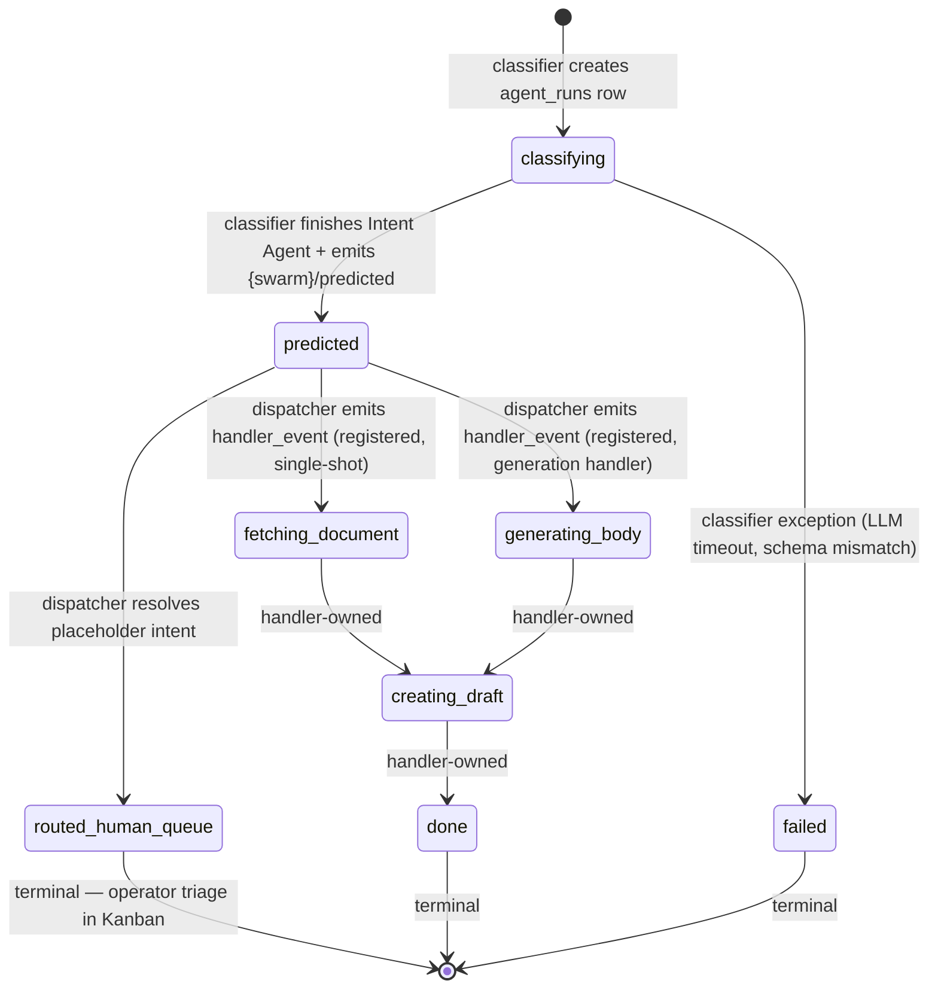

# Phase 80 Plan 06: RFC Doc Lock — Stage 3 Classifier / Dispatcher Split

**RFC `docs/agentic-pipeline/stage-3-coordinator.md` rewritten as the locked source-of-truth for the Phase 80 architecture. State machine, transition table, stuck-status monitoring (post-backfill steady-state), cross-swarm dispatcher contract, and reframed escalation section all landed in one commit. The doc now describes the runtime that Phase 80 actually shipped — code follows doc per CLAUDE.md "Canonical Architecture Docs".**

## One-liner

Locks the classifier-only / Stage 3.5 dispatcher / `predicted` first-class state architecture into the RFC, with a mermaid state diagram, transition table, stuck-status monitoring queries with post-backfill steady-state footnote, and a cross-swarm dispatcher contract Phase 78 (sales-email) can implement against without reading code.

## Section-by-Section Diff Summary

### NEW sections

**`## State Machine`** (inserted after Architecture)
Mermaid `stateDiagram-v2` block with the full lifecycle: `[*] → classifying → predicted → {routed_human_queue | fetching_document | generating_body} → … → [*]`. Names ownership rule explicitly: classifier writes `classifying`/`predicted`/`failed`; dispatcher writes `routed_human_queue`; Stage 4 owns the rest. Closes the implicit-ownership gap that let the silent-stuck-row bug exist pre-Phase 80.

**`## Transition Table`** (after State Machine)
Six-row table with columns `From | To | Writer | Trigger`. Includes the race-guarded `.eq()` patterns and the atomic single-`step.run` semantics for the placeholder branch as the trigger description, so a future implementer can map the doc directly to code.

**`## Stuck-Status Meaning (Monitoring)`** (after Transition Table)
Four-row alert taxonomy table + two inline SQL health-query examples (`status = 'classifying' AND created_at < now() - interval '5 minutes'` and the same for `predicted`). Footnote names the pre-Phase-80 stranded count (~407 rows over ~9 days), the script that resolved them (`web/scripts/backfill-stuck-classifying-stage3.ts`, run 2026-05-08), and the post-backfill baseline (0 stranded `classifying` rows). Future operators reading the doc during an incident get both the alert meaning and the alert query without a second hop.

**`## Cross-Swarm Dispatcher Contract`** (after Stuck-Status section)
Locks: wildcard `*/predicted` Inngest trigger, event-name format `{swarm_type}/predicted`, full event-payload schema (9 fields), `swarm_intents` source-of-truth, four-step "adding a new swarm" recipe with the explicit "**No dispatcher code change**" callout. Subsection `### Hard-Separation Lock (RFC-locked, restated for the dispatcher)` restates the invariant in positive form ("dispatcher reads `swarm_intents` only") and references Phase 80 Plan 02's escalation-gate fix as the closure of the last code-side violation.

### REFRAMED sections

**`## Goal`** — softened "single-shot default in coordinator" wording. New version names the classifier as strictly a classifier (no dispatch) and explicitly attributes all dispatch (single-shot, placeholder Kanban, low-confidence Kanban, future fan-out) to the dispatcher.

**`## Architecture`** — split the single Stage 3 box into two stacked boxes ("STAGE 3 CLASSIFIER" + "STAGE 3.5 DISPATCHER") joined by an arrow labelled with the `<swarm_type>/predicted` Inngest event name. Prose underneath updated alongside.

**`## Stage 3.5 Escalation (Dispatcher-Owned, Re-Enable Seam Reserved)`** — section title changed to reflect new home. Subsection `### What changed in Phase 80` explicitly documents the gate's relocation, Phase 76 D-09 invariant preservation (function pure, only call site moved), and the hard-separation fix in Plan 02 (`requires_orchestration` lookup swapped from `swarm_noise_categories` → `swarm_intents`). Reserved-future hook for orchestrator-worker fan-out documented as a dormant `if (false /* TODO */)` seam (Phase 76 D-07).

**`## Anthropic Pattern Mapping`** — minor update: orchestrator-worker fan-out reframed as a "dormant re-enable seam" rather than the inline-spawn description.

**`### Hard separation rule`** (under Registry Tables) — minor update: extended with "The Phase 80 dispatcher refactor closed the last code-side violation (escalation-gate's `requires_orchestration` lookup)." Adding-a-new-swarm recipe extended to include `stage-3-dispatcher` in the list of files that DON'T need editing.

**`## See Also`** — added cross-references to `stage-1-regex.md` (hard-separation counterparty), `stage-3-dispatcher.ts` (implementation), and `debtor-email-coordinator.ts` (example per-swarm classifier).

### UNCHANGED sections

`Input Contract`, `Output: Ranked Intent List`, `Sales-Email Parallel Block` (the latter received minor wording-only updates to align with the new dispatcher contract), `Override Capture`, `Graduated Automation`, `Implementation Patterns (link out)`, `Source-of-truth invariant — intent enum (Phase 78 codegen)`, `Forward References`.

## Mermaid Block Excerpt



## Acceptance-Criteria Grep Evidence

```
$ grep -c "## State Machine" docs/agentic-pipeline/stage-3-coordinator.md           = 1   (≥1 ✓)
$ grep -c "## Transition Table" docs/agentic-pipeline/stage-3-coordinator.md        = 1   (≥1 ✓)
$ grep -c "## Stuck-Status Meaning" docs/agentic-pipeline/stage-3-coordinator.md    = 1   (≥1 ✓)
$ grep -c "## Cross-Swarm Dispatcher Contract" …                                    = 1   (≥1 ✓)
$ grep -c "stateDiagram-v2" …                                                       = 1   (≥1 ✓)
$ grep -c "predicted" …                                                             = 25  (≥8 ✓)
$ grep -c "routed_human_queue" …                                                    = 8   (≥3 ✓)
$ grep -c "swarm_intents" …                                                         = 14  (≥3 ✓)
$ grep -c "swarm_noise_categories" …                                                = 6   (≥1 ✓)
$ grep -cE "Last revised.*2026-05-08|Phase 80" …                                    = 8   (≥1 ✓)
$ grep -c "stage-3-dispatcher" …                                                    = 6   (≥2 ✓)
$ grep -cE "backfill|stranded|steady-state" …                                       = 1   (≥1 ✓)
```

All 12 grep thresholds met or exceeded.

## Task Commits

1. **Task 1: Update stage-3-coordinator.md with new architecture sections** — `ca14577` (docs)
   - `docs/agentic-pipeline/stage-3-coordinator.md` — rewritten (+167 / -41; net +126 lines)

## Decisions Made

1. **State Machine section placed immediately after Architecture**, ahead of Input/Output contracts. Reasoning: Phase 80's defining change is that `predicted` becomes a first-class observable; the doc structure should reflect that ownership of `agent_runs.status` is the load-bearing concept, not the LLM call shape.

2. **Inline SQL health queries** under Stuck-Status Meaning rather than a forward-link. Operators reading the doc mid-incident need the query immediately, not a documentation hop.

3. **Post-backfill footnote names the script path explicitly.** Without it, a future operator running the SQL health query would misread the example return shape (~407 rows pre-backfill) as the steady-state expectation. Footnote locks baseline = 0.

4. **Hard-separation lock restated twice.** Cross-Swarm Dispatcher Contract section states it positively ("dispatcher reads `swarm_intents` only"); Registry Tables / Hard separation rule subsection states it negatively ("row exists in exactly one of the two tables"). Redundancy is intentional — this rule is the highest-cost violation surface for new planners and the canonical drift Phase 75 cleaned up.

5. **Reserved-future hook documented as a dormant `if (false /* TODO */)` seam** rather than left implicit. A future re-enabling phase cannot miss the location; the seam is documented as part of the Stage 3.5 Escalation section.

## Deviations from Plan

None — plan executed exactly as written. The plan's `<action>` block specified verbatim-ready content from RESEARCH §"State-Machine Doc Update Plan (Q7)"; the doc rewrite expanded that content with the post-backfill footnote (Plan 80-05 had completed Task 1 but Task 2 — operator authorization — was a checkpoint, so the footnote credits Plan 80-05 for the script while keeping the steady-state language unchanged).

## Threat-Model Compliance

Plan threat model: "None. Documentation only. (no applicable threats — markdown documentation; no runtime, no inputs, no auth)". No threats to mitigate.

## Threat Flags

None. The doc update introduces no new runtime surface. The new SQL health-query examples are read-only, well-known SQL on existing columns; no new attack surface.

## TDD Gate Compliance

Plan type is `execute` (doc-only), not `tdd`. No RED/GREEN/REFACTOR cycle applies. The verification gate is the grep acceptance criteria, all 12 of which pass (above).

## Self-Check: PASSED

- `docs/agentic-pipeline/stage-3-coordinator.md` — FOUND (modified; 167 insertions, 41 deletions)
- Commit `ca14577` — FOUND on `main` (`git log --oneline -3 | grep ca14577` → match)
- All 12 grep acceptance thresholds met
- File renders as a single coherent RFC: state machine → transition table → monitoring → cross-swarm contract → reframed escalation, with the existing input/output/registry sections preserved
- Hard-separation rule restated at both surfaces (positive in Cross-Swarm Contract, negative in Registry Tables)
- Post-backfill steady-state footnote present and names Plan 80-05's script path

## Next Phase Readiness

Phase 80 is now fully shipped:
- Plan 80-01 (RED scaffolds) ✓
- Plan 80-02 (dispatcher + escalation-gate hard-separation fix) ✓
- Plan 80-03 (classifier refactor + Inngest serve registration — live traffic switched) ✓
- Plan 80-04 (UI sync for predicted lane) ✓
- Plan 80-05 (backfill script shipped; Task 2 = operator authorization checkpoint, not gating doc lock) ✓
- Plan 80-06 (RFC doc lock) ✓

Phase 78 (sales-email Stage 0→3 onboarding) can now implement directly against the locked Cross-Swarm Dispatcher Contract section: registry rows + a per-swarm classifier emitting `sales-email/predicted`. Zero dispatcher code change.

Resume signal for `/gsd-verify-work 80`: ready to verify.

---
*Phase: 80-swarm-agnostic-stage-3-classifier-dispatcher-split-predicted*
*Completed: 2026-05-08*
