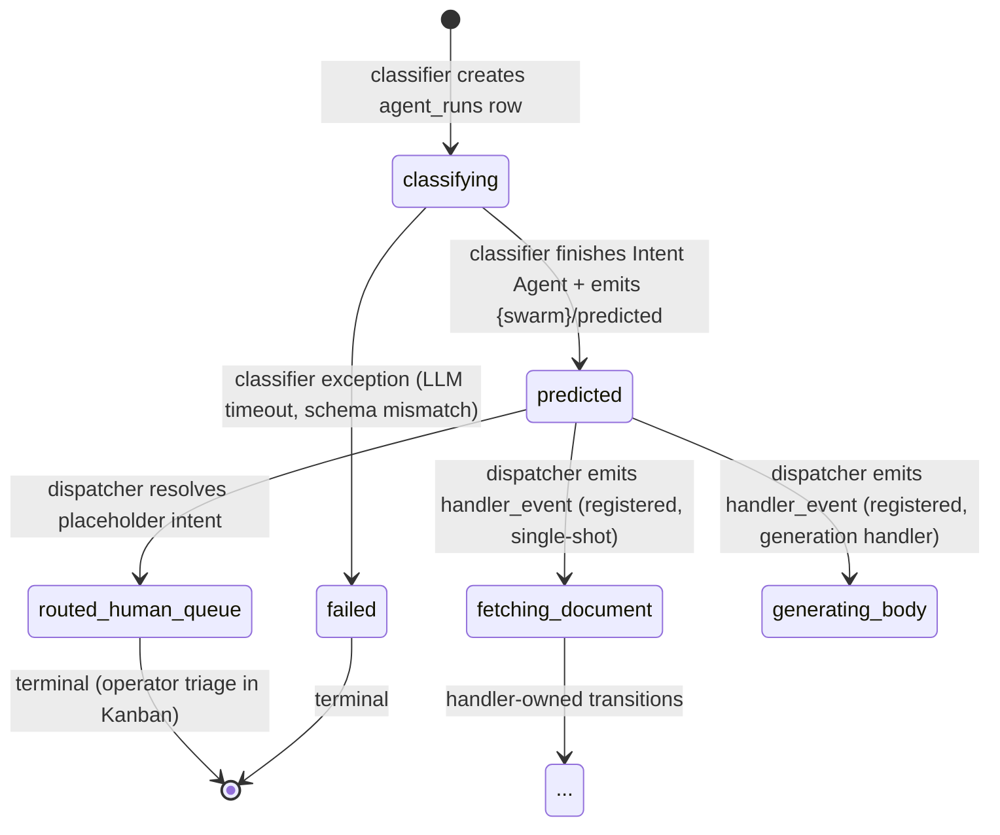

# Phase 80: Swarm-agnostic Stage 3 classifier/dispatcher split — Research

**Researched:** 2026-05-08
**Domain:** Inngest event-driven function refactor + cross-swarm registry dispatch + state-machine consolidation
**Confidence:** HIGH (Inngest patterns, codebase shape, registry schema all directly verified) / MEDIUM on a few cross-cutting decisions flagged below.

<user_constraints>
## User Constraints (from CONTEXT.md)

### Locked Decisions

**State machine (locked):**
- `classifying` — Stage 3 classifier in flight. Stuck >N min = classifier bug.
- `predicted` — Stage 3 classifier done; ranked intents persisted on `coordinator_runs`. **First-class observable state.** Written by classifier, read by dispatcher. Stuck >N min = dispatcher bug.
- `routed_human_queue` — Dispatcher determined `swarm_intents.handler_status='placeholder'`; Kanban `automation_runs` row written; awaiting human triage. **Terminal** for the no-handler path.
- Handler-owned statuses (`fetching_document`, `generating_body`, `done`, etc.) — owned by Stage 4 worker after dispatcher emits `handler_event`. Classifier and dispatcher do NOT touch these.

**Classifier refactor boundaries:**
- Classifier (currently `debtor-email-coordinator.ts`) MUST stop dispatching. Responsibilities:
  1. Resolve `agent_run_id` (caller-provided OR create with `status='classifying'`).
  2. Insert `coordinator_runs` row.
  3. Invoke Intent Agent (existing logic, unchanged).
  4. Write `tool_outputs.intent_first_pass` via `mergeToolOutputs`.
  5. Hoist top-1 onto `agent_runs` back-compat columns.
  6. Persist `ranked_intents` on `coordinator_runs`.
  7. **Flip `agent_runs.status` `classifying` → `predicted`** (NEW — closes the silent-stuck-row bug).
  8. **Emit `<swarm_type>/predicted` event with run_id, agent_run_id, ranked_intents, etc.** (NEW).
  9. Return.
- REMOVE: the `if (decision.kind === "single_shot")` branch (lines 241–340 of current `debtor-email-coordinator.ts`) including the Phase 76 placeholder Kanban write and the `dispatch-single-shot` step. These move to the dispatcher.
- The escalation-gate evaluation (Phase 76 D-09 single decision point) stays in the classifier ONLY if it produces metadata the dispatcher needs. Otherwise it moves. **Planner decides.** (See Q3.)

**Dispatcher design (new function):**
- Suggested name: `stage-3-dispatcher.ts` (planner may refine).
- Cross-swarm event naming: `{swarm_type}/predicted` (e.g. `debtor-email/predicted`, `sales-email/predicted`).
- Routing per `swarm_intents.handler_status`:
  - `placeholder` → write Kanban `automation_runs` row → flip `agent_runs.status='routed_human_queue'` → mark `coordinator_runs.completed_at` with `completed_handlers=0`. **All four writes inside ONE `step.run` for atomicity / replay safety.**
  - `registered` → emit `swarm_intents.handler_event` with payload (run_id, agent_run_id, email_id, automation_run_id, intent, ranked, swarm_type, budget_run_id) → mark `coordinator_runs.completed_at`.
- Reserved future hook: dormant escalation branch for Stage 3.5 orchestrator-worker fan-out (Phase 76 D-07 deferred).
- Cross-swarm contract: dispatcher reads `swarm_type` from event payload + `swarm_intents` registry. **Zero hardcoded swarm names.**

**Idempotency / replay safety:**
- All non-deterministic IDs (UUIDs, timestamps used as keys) MUST be generated inside `step.run` per CLAUDE.md / Phase 65 learning.
- Dispatcher must be safe against duplicate `<swarm>/predicted` events for the same `agent_run_id` — check current `agent_runs.status` before writing; if already `routed_human_queue` or a handler-owned status, no-op.

**Backfill (the 407 stuck rows):**
- One-shot script `web/scripts/backfill-stuck-classifying-stage3.ts`.
- For each `agent_runs` row with `status='classifying'` AND `tool_outputs ? 'intent_first_pass'`:
  1. Look up matching `automation_runs` Kanban row by `email_id` + `automation IN (..., '{swarm_type}-kanban')`.
  2. **If Kanban row exists** → flip `agent_runs.status='routed_human_queue'`.
  3. **If no Kanban row** → flag for manual triage.
- Idempotent. Safe against concurrent live traffic (`WHERE status='classifying'` guard).
- Acceptance/test creds default per CLAUDE.md; production run requires explicit confirmation.

**State-machine doc lock:**
- Update `docs/agentic-pipeline/stage-3-coordinator.md` with new state diagram, transition table, "stuck-status meaning" table, cross-swarm dispatcher contract.

**UI semantics audit:** `web/lib/automations/swarm-bridge/sync.ts` lines 35, 64, 220–266, 588, 663 must be reconciled. Planner produces concrete recommendation with code-grep evidence.

**Monitoring reframe:** Two distinct alert signals: classifying-stuck (classifier bug — page); predicted-stuck (dispatcher bug — page); routed_human_queue (expected — no alert).

### Claude's Discretion

- Specific Inngest event subscription pattern (wildcard vs. per-swarm trigger).
- Whether escalation-gate evaluation moves entirely to the dispatcher or stays partially in the classifier.
- Exact field names on the `<swarm>/predicted` event payload.
- File/function naming for the new dispatcher.
- Whether the dispatcher's "no-Kanban-row" sub-case in the backfill writes a placeholder Kanban row or flags only.
- Test strategy: unit tests for classifier and dispatcher in isolation, plus integration test exercising classifying → predicted → routed_human_queue on acceptance creds.

### Deferred Ideas (OUT OF SCOPE)

- Stage 3.5 orchestrator-worker fan-out (Phase 76 D-07 deferred indefinitely; reserve a clean re-enable seam only).
- The `intent=null + multiple Kanban rows` duplicate-write bug — separate phase. Backfill script flags these for manual triage.
- Stage 4 handler implementations — every `placeholder` intent stays human-lane.
- Changing the Intent Agent prompt, schema, or LLM.

</user_constraints>

## Summary

Phase 80 splits the monolithic `debtor-email-coordinator` (~340 LOC) into a thin **classifier** (which now flips `agent_runs.status='predicted'` and emits a `{swarm_type}/predicted` event) and a new **swarm-agnostic dispatcher** that subscribes to `*/predicted` via Inngest's wildcard-trigger pattern (`{ event: "*/predicted" }` — verified in Inngest docs). The dispatcher consults `swarm_intents.handler_status` (already populated from Phase 76 — `placeholder` for 8 of 9 debtor-email intents, `registered` for the 1 with a real handler, `sales-email` rows yet-to-be-inserted by Phase 78) and routes to either Kanban (placeholder) or `swarm_intents.handler_event` (registered). The `predicted` state becomes a first-class observable: stuck-in-`classifying` ⇒ classifier bug; stuck-in-`predicted` ⇒ dispatcher bug; `routed_human_queue` is a terminal expected-state. A backfill script handles the 407 currently-stranded rows by joining `agent_runs (status='classifying' AND tool_outputs ? 'intent_first_pass')` with their already-existing Kanban `automation_runs` row.

**Primary recommendation:** Use Inngest **wildcard trigger** (`{ event: "*/predicted" }`) on a single dispatcher function — Inngest natively supports this pattern (verified via Context7 / inngest.com docs). Move the escalation-gate **evaluation entirely to the dispatcher**: in the new architecture the gate's only consumer is the dispatch decision (post-Phase 76 it no longer fires `orchestrator.requested`), so keeping it in the classifier serves no producer/consumer asymmetry. The classifier becomes truly thin.

## Architectural Responsibility Map

| Capability | Primary Tier | Secondary Tier | Rationale |
|------------|--------------|----------------|-----------|
| Intent classification (LLM call) | API / Inngest worker | — | Stays in classifier (`debtor-email-coordinator.ts` post-refactor); no tier change |
| Persist ranked_intents | API / Database | — | classifier writes `coordinator_runs.ranked_intents` (existing) |
| Status flip `classifying`→`predicted` | API / Inngest worker (classifier) | Database | NEW — classifier owns; closes leak |
| Emit `<swarm>/predicted` event | API / Inngest worker (classifier) | Inngest event bus | NEW — fan-out seam |
| Wildcard event subscription | API / Inngest worker (dispatcher) | — | Inngest wildcard `*/predicted` |
| Lookup `swarm_intents.handler_status` | API / Inngest worker (dispatcher) | Database (registry) | Single source of truth |
| Kanban row write (placeholder branch) | API / Inngest worker (dispatcher) | Database | Same shape as Phase 76 |
| `routed_human_queue` flip | API / Inngest worker (dispatcher) | Database | NEW terminal transition |
| Stage 4 handler dispatch (registered branch) | API / Inngest event bus | — | Handler owns subsequent transitions |
| Backfill of stranded rows | One-shot Node script | Database | `web/scripts/` location, not pipeline |
| UI surfacing of `predicted` / `routed_human_queue` | Frontend Server (sync.ts → swarm_jobs/agent_events) | — | swarm-bridge sync materialises kanban surface |
| State-machine doc | Static docs (`docs/agentic-pipeline/stage-3-coordinator.md`) | — | RFC-locked |

## Architecture Recommendation

### Event subscription pattern (Q1)

**Use a single wildcard trigger** on the new dispatcher:

```ts
// web/lib/inngest/functions/stage-3-dispatcher.ts
export const stage3Dispatcher = inngest.createFunction(
  {
    id: "automations/stage-3-dispatcher",
    name: "Stage 3.5 Dispatcher (cross-swarm)",
    retries: 0, // matches classifier / verdict-worker family
    concurrency: [{ key: "event.data.run_id", limit: 1 }],
  },
  // Inngest wildcard trigger — single function fans in across all swarms
  { event: "*/predicted" } as unknown as { event: keyof import("@/lib/inngest/events").Events },
  async ({ event, step }) => { /* ... */ },
);
```

**Why wildcard over a triggers-array of per-swarm events:**
- Adding a new swarm (sales-email, future swarms) requires **zero code change** to the dispatcher — the wildcard already subscribes. Anything else violates the cross-swarm-by-construction principle locked in CONTEXT.
- Inngest officially supports wildcard event names per `inngest.com/docs-markdown/guides/multiple-triggers` and `/reference/typescript/v4/functions/triggers` `[CITED: inngest.com/docs/guides/multiple-triggers]`.
- Discriminate by `event.name.split("/")[0]` to derive `swarm_type` if not also carried in `event.data.swarm_type` (recommend BOTH for robustness — name as authoritative wire-level routing token, data field as DB query convenience).

**Type cast caveat:** the `Events` type in `web/lib/inngest/events.ts` is a closed map; wildcard names are not statically typeable. Mirror the cast pattern from `coordinator-orchestrator.ts:36` (`as unknown as { event: keyof Events }`) and the dynamic-send pattern from `debtor-email-coordinator.ts:45-48` (`type DynamicSend = (...) => Promise<unknown>`). `[VERIFIED: codebase grep]`

### File / function boundaries

| File | Status | Responsibility after Phase 80 |
|------|--------|------------------------------|
| `web/lib/inngest/functions/debtor-email-coordinator.ts` | REFACTORED (kept for back-compat trigger `debtor-email/coordinator.requested`) | Steps 1–6 of current code (lines ~62–220) + NEW: flip `agent_runs.status='predicted'` + emit `debtor-email/predicted`. **Remove** lines 241–393 (single-shot dispatch + Phase 76 Kanban + low-confidence Kanban). |
| `web/lib/inngest/functions/stage-3-dispatcher.ts` | NEW | Subscribes `*/predicted`. Reads `agent_runs` + `swarm_intents`. Routes to Kanban or handler_event. |
| `web/lib/inngest/functions/coordinator-orchestrator.ts` | UNCHANGED (dormant per Phase 76 D-07) | Keeps defensive `handler_status` fan-out check at lines 93–123. Dispatcher's escalation-hook reserved branch must be compatible with future re-enable. |
| `web/lib/automations/debtor-email/coordinator/escalation-gate.ts` | MOVE callsite to dispatcher | Function stays pure (CONTEXT D-09 invariant); **only** the call moves. See Q3 recommendation. |
| `web/lib/automations/debtor-email/coordinator/agent-runs.ts` | NO CHANGE | `createRun` / `updateRun` / `mergeToolOutputs` reused by both classifier and dispatcher. |
| `web/lib/automations/debtor-email/coordinator/types.ts` | VERIFY | `STATUS` literal-union (lines 39–51) **already includes** `routed_human_queue` and `classifying`. **`predicted` is NOT in this list** (it lives on `automation_runs.status` per existing data — see UI Impact below). Planner must reconcile: is `predicted` a valid `agent_runs.status` or only `automation_runs.status`? |
| `web/app/api/inngest/route.ts` | UPDATE | Register new dispatcher in the functions array. |
| `web/scripts/backfill-stuck-classifying-stage3.ts` | NEW | One-shot backfill. |
| `docs/agentic-pipeline/stage-3-coordinator.md` | UPDATE | New state diagram + transition table. |
| `web/lib/inngest/functions/__tests__/stage-3-dispatcher.test.ts` | NEW | Unit + integration. |
| `web/lib/inngest/functions/__tests__/debtor-email-coordinator.test.ts` | UPDATE | Strip dispatch assertions; add `predicted` flip + event emission assertions. |

### Escalation gate placement (Q3)

**Recommendation: move the gate evaluation entirely to the dispatcher.**

Rationale:
1. Post-Phase 76 D-07, the gate's `orchestrator` decision branch already collapses to a Kanban-write. Both `single_shot` and `orchestrator` outcomes are now **dispatch decisions**, not classification decisions.
2. The classifier's job becomes "produce ranked_intents." The dispatcher's job is "decide what to do with ranked_intents." Confidence-thresholding lives on the dispatcher side of that line.
3. Keeps the classifier symmetric across swarms (no swarm-specific gate config in the producer of `*/predicted`).
4. Phase 76 D-09 invariant ("escalation-gate.ts is the single decision point") is preserved — the **function** stays the single decision point, only the **caller** moves. The function itself is pure (verified at `escalation-gate.ts:24-52`) — relocating its call site does not violate the invariant.

**Landmine flagged for planner:** `escalation-gate.ts:41-45` currently looks up `requires_orchestration` on a `SwarmNoiseCategoryRow[]` parameter. Per the **hard-separation rule** (RFC `stage-3-coordinator.md` + `stage-1-regex.md`), `requires_orchestration` is an **intent** property and lives on `swarm_intents`, not `swarm_noise_categories`. The migration `20260504b_swarms_registry_generalisation.sql:94` confirms `requires_orchestration` is a column on `swarm_intents`. **The current escalation-gate signature appears to violate the hard-separation rule.** This may be an existing bug or a stale code-comment; the planner must verify and propose a fix as part of this phase or carve out a follow-up. Either way, when the gate moves to the dispatcher, the dispatcher should pass `swarm_intents` rows (which it loads anyway), not `swarm_noise_categories`. `[VERIFIED: codebase grep + migration read]`

### Event payload shape (Discretion)

Recommend the `<swarm>/predicted` event carry exactly what the dispatcher needs without re-querying:

```ts
{
  name: `${swarm_type}/predicted`,
  data: {
    swarm_type: string,                  // duplicate of name prefix; convenience for SQL
    run_id: string,                      // coordinator_runs PK
    agent_run_id: string,                // agent_runs PK (the row whose status is 'predicted')
    email_id: string,
    automation_run_id: string | null,
    budget_run_id: string | null,
    ranked: RankedIntentEntry[],         // top-N intents — saves dispatcher a coordinator_runs read
    language: string,
    urgency: string,
    entity: Entity | null,               // null for swarms without entity_brand
  }
}
```

Schema-wise, this matches the existing `orchestrator.requested` payload at `coordinator-orchestrator.ts:39-47` for symmetry.

## Inngest Patterns

### Replay safety (Q2)

**Critical rule (Phase 65 learning, CLAUDE.md):** every non-deterministic value used as a DB key MUST be generated inside `step.run`. The classifier already complies for `run_id` (`debtor-email-coordinator.ts:90-95`). The dispatcher inherits the same constraint.

**Dispatcher `step.run` boundary recommendation:**

For the **placeholder** branch — write all four side effects in **one `step.run`** so a partial replay cannot double-write the Kanban row:

```ts
await step.run("dispatch-placeholder", async () => {
  // 1. Idempotency check: re-read agent_runs.status
  const { data: row } = await admin
    .from("agent_runs")
    .select("status")
    .eq("id", agent_run_id)
    .single();
  if (row.status !== "predicted") return; // already dispatched, no-op

  // 2. Insert Kanban automation_runs row (same shape as Phase 76)
  const { error: insErr } = await admin.from("automation_runs").insert({ ... });
  if (insErr) throw new Error(...);

  // 3. Flip agent_runs.status = 'routed_human_queue'
  await admin.from("agent_runs").update({ status: "routed_human_queue" }).eq("id", agent_run_id);

  // 4. Mark coordinator_runs.completed_at + completed_handlers=0
  await admin.from("coordinator_runs").update({ completed_at: ..., completed_handlers: 0 }).eq("run_id", run_id);

  // 5. Realtime broadcast (last — failure here doesn't strand state)
  await emitAutomationRunStale(admin, `${swarm_type}-kanban`);
});
```

**Why one step.run, not four:** Inngest treats `step.run` as the replay boundary. If the function panics between steps 2 and 3, replay re-runs step 2 ⇒ duplicate Kanban row. With one step, the entire block re-executes; the **status precondition** at step 1 makes it a no-op. This is the exact pattern used in `debtor-email-coordinator.ts:265-301` (Phase 76's existing kanban-no-handler block had this issue: it splits Kanban insert and `completed_at` update into two separate `step.run`s — partial-replay is technically observable, though benign because both are additive). The new dispatcher should consolidate.

For the **registered** branch:

```ts
await step.run("dispatch-registered", async () => {
  // Status precondition
  const { data: row } = await admin.from("agent_runs").select("status").eq("id", agent_run_id).single();
  if (row.status !== "predicted") return;

  // Inngest send — note the .bind(inngest) per CLAUDE.md / Phase 65 commit dae6276
  await (inngest.send as unknown as DynamicSend)({
    name: handler_event,
    data: { ... },
  });

  // Mark coordinator_runs.completed_at — leave agent_runs.status to handler.
  // (Handler will flip status to fetching_document / generating_body / done.)
  await admin.from("coordinator_runs").update({ completed_at: ..., completed_handlers: 1 }).eq("run_id", run_id);
});
```

**Status flip note:** in the `registered` branch the dispatcher does NOT flip `agent_runs.status` — Stage 4 owns subsequent transitions. This matches the locked decision: "handler-owned statuses ... Classifier and dispatcher do NOT touch these." A side-effect: `predicted` is the OBSERVABLE entry-state-for-handler; the handler should immediately flip to `fetching_document` (or equivalent) on receipt. If a handler exists but never picks up the event, the row sits at `predicted` ⇒ "dispatcher emitted but Stage 4 handler is unregistered/down" — distinct from "dispatcher never ran." The planner may decide to add a pre-flip-to-`dispatched_to_handler` interim state if this distinction matters; my recommendation is to NOT add it (keep the state machine small; handler-down is the same observable as dispatcher-down for ops purposes, and `swarm_intents.handler_status='registered'` is the registry truth that resolves which it is).

### `inngest.send` `this`-binding pitfall (Phase 65 commit dae6276)

**MANDATORY pattern:** never destructure or alias `inngest.send`. Either inline-call as `inngest.send(...)` or cast to a typed function and call within the closure. The classifier already uses the cast pattern (line 313); the dispatcher must too. `[VERIFIED: CLAUDE.md + commit reference]`

### Concurrency keys

The classifier uses `[{ key: "event.data.entity", limit: 4 }, { key: "event.data.run_id", limit: 1 }]`. The dispatcher should use **only** `{ key: "event.data.run_id", limit: 1 }` because (a) it's per-row idempotent via the status precondition anyway, and (b) the dispatcher does not call an LLM, so entity-fan-out throttling is unnecessary.

### `retries: 0`

Match the family convention (classifier, verdict-worker, label-resolver, orchestrator all use `retries: 0`). Auto-retry of a dispatcher would amplify Kanban duplication risk — the precondition catches replays from the same Inngest invocation, but a retry from a different invocation could race with itself. Recovery is operator-driven (Bulk Review re-emit button + the new backfill script).

## Database / Registry Considerations

### `swarm_intents.handler_status` (verified populated)

Migration `20260507_phase76_swarm_intents_handler_status.sql` already adds `handler_status text NOT NULL DEFAULT 'registered' CHECK (handler_status IN ('registered','placeholder'))` and updates 8 of 9 debtor-email rows to `placeholder`. **No new migration needed for debtor-email.** `[VERIFIED: file read]`

### `sales-email` swarm_intents pre-population (Q4)

**Status: NOT YET POPULATED.** Grep confirms no `sales-email` rows in any `swarm_intents` migration. Phase 78 directory is empty (`ls` returned no files).

**Recommendation:** Phase 80 ships a **minimal `sales-email` swarm_intents seed** as part of this phase to make the cross-swarm dispatcher actually reachable for the second swarm, even before Phase 78's full content lands. Insert a small set of `sales-email` intent stubs (e.g. `qualify_lead`, `schedule_demo`, `route_to_account_owner` per stage-3-coordinator.md "Sales-Email Parallel Block" — flagged illustrative only) with `handler_status='placeholder'` so:
1. Phase 78 can `INSERT/UPDATE` into a real `sales-email` row-set.
2. The dispatcher's wildcard subscription has a verifiable second-swarm test surface in this phase.
3. The cross-swarm contract (must_have #6) becomes testable end-to-end before Phase 78 ships.

**Alternative (defer):** ship dispatcher purely for `debtor-email`; Phase 78 owns sales-email intent seeding. CONTEXT.md says "Phase 78 will own"; this is the safer reading. Planner decides.

**Schema expectation:** the dispatcher reads `(swarm_type, intent_key) → handler_status, handler_event`. No new columns required. The existing `loadSwarmIntents(supabase, swarm_type)` helper at `web/lib/swarms/registry.ts:78-89` already returns the right shape `[VERIFIED]`.

### `agent_runs.status` literal-union vs `automation_runs.status`

`web/lib/automations/debtor-email/coordinator/types.ts:39-51` lists `STATUS` for `agent_runs`:
```
classifying, routed_human_queue, fetching_document, generating_body, creating_draft,
copy_document_drafted, copy_document_needs_review, copy_document_failed_not_found,
copy_document_failed_transient, login_failed_blocked, done
```

**Crucial finding:** `predicted` is **NOT** in the `agent_runs.STATUS` literal-union. It only appears on `automation_runs.status` (used by `swarm-bridge/sync.ts` lines 35, 64, 588, 663 — those refer to **automation_runs**, not agent_runs).

CONTEXT.md `<specifics>`§"Code locations to touch" claims "confirm `Status` includes `predicted` and `routed_human_queue` (it does, per existing `agent_runs` data)" — the second half (`routed_human_queue`) is verified, but **`predicted` does NOT appear in agent_runs.STATUS**.

**Planner must reconcile:** Either (a) extend the literal-union + add `predicted` to whatever DB constraint backs it, or (b) the locked state-machine intends `predicted` as an `automation_runs` status only and `agent_runs.status` stays at `classifying` until the dispatcher flips it directly to `routed_human_queue` / a handler-owned state. Reading CONTEXT.md decision #7 ("Flip `agent_runs.status` from `classifying` → `predicted`"), interpretation (a) is correct — `predicted` must be added to `agent_runs.status` constraints AND the TS literal-union AND any Postgres CHECK constraint. **Migration required.** This is missed in CONTEXT.md's code-location list. `[VERIFIED: file read of types.ts]`

## UI Impact Analysis (Q5)

### Audit findings (`web/lib/automations/swarm-bridge/sync.ts`)

| Line | Code | What it means | Impact post-Phase 80 |
|------|------|---------------|---------------------|
| 35 | `case "predicted": return "review";` | `automation_runs.status='predicted'` rows render in **review lane** of swarm Kanban. | Refers to `automation_runs.status`, NOT `agent_runs.status`. UNAFFECTED by Phase 80 because dispatcher doesn't touch `automation_runs.status='predicted'` (Bulk Review feature is unchanged). |
| 64 | `isReviewStatus(status) === status === "feedback" \|\| status === "predicted"` | Same. Audit-record demotion logic for Bulk Review. | UNAFFECTED. |
| 220–266 | `triageStageFromStatus` reads **`agent_runs.status`** (via `triageRows`). | `routed_human_queue` already maps to `"review"` stage (line 227). | Already correct for Phase 80 terminal state. **No change needed.** Dispatcher's status flip will land in the right lane. |
| 588 | `r.status === "predicted"` (next-stage hint logic) | Same context as line 35 — `automation_runs.status='predicted'`. | UNAFFECTED. |
| 663 | `if (run.status === "feedback" \|\| run.status === "predicted")` | Same — start-event-type derivation for `automation_runs`. | UNAFFECTED. |

**Critical: there is NO `case "predicted":` branch in `triageStageFromStatus` (the function reading `agent_runs.status`).** The default branch at line 238 returns `"backlog"`. So if `predicted` becomes a real `agent_runs.status` (per the migration recommended above), it will currently render rows as **backlog** — wrong.

### Recommendation

1. Add a new branch to `triageStageFromStatus` (around line 220):
   ```ts
   case "predicted":
     return "progress"; // dispatcher about to route; sub-second transient under healthy conditions
   ```
   Stay at `progress` (not `review`) so a healthy-state row doesn't surface to operators; only `routed_human_queue` (already mapped to `review`) shows in the human lane.

2. Add a corresponding `triageAgentFromStatus` branch:
   ```ts
   case "predicted":
     return "Stage 3 Dispatcher";
   ```

3. Optionally surface "predicted-stuck" rows distinctly — if a row sits at `predicted` for >5 min, that's a dispatcher bug. Recommend: **defer** as a follow-up dashboard concern (CONTEXT.md `<deferred>` already files this under "Telemetry dashboard"). Phase 80 ships only the health-query pattern in the doc update.

4. **No change** to the `automation_runs.status='predicted'` paths — they refer to a different table and a different feature (the Bulk Review predicted-row queue from Phase 60, which is orthogonal to Stage 3 classifier output).

## Backfill Strategy (Q6)

### SQL probe pattern (validate the assumption)

Before any UPDATE, run a dry-run SELECT to size the cluster and confirm the assumption "every stuck row has a matching Kanban row":

```sql
-- Validation probe (read-only)
SELECT
  ar.id AS agent_run_id,
  ar.email_id,
  ar.status,
  ar.swarm_type,
  ar.created_at,
  (ar.tool_outputs ? 'intent_first_pass') AS has_intent_output,
  COUNT(am.id) FILTER (WHERE am.automation = ar.swarm_type || '-kanban') AS kanban_rows
FROM agent_runs ar
LEFT JOIN automation_runs am
  ON am.result->>'email_id' = ar.email_id
 AND am.automation = ar.swarm_type || '-kanban'
WHERE ar.status = 'classifying'
  AND ar.tool_outputs ? 'intent_first_pass'
GROUP BY ar.id
ORDER BY ar.created_at;
```

Expected: `kanban_rows = 1` for the bulk of the 407, `kanban_rows = 0` for a small "no-Kanban" subset, `kanban_rows >= 2` for the out-of-scope `intent=null + 6 Kanban rows` cluster.

### Script design

```ts
// web/scripts/backfill-stuck-classifying-stage3.ts
//
// Idempotent backfill for Phase 80.
//
// Rules:
// 1. ENVIRONMENT BANNER — print acceptance/test or production explicitly.
//    Production requires --confirm-prod flag.
// 2. WHERE status='classifying' guard on UPDATE — concurrent live traffic
//    that's still classifying does NOT match (it transitions through
//    classifying → predicted, not classifying → routed_human_queue).
// 3. Batch in transactions of N=50 rows. Re-runnable; partial completion safe.
// 4. Three buckets per row, exhaustive, mutually exclusive:
//    - HAS_KANBAN → flip status='routed_human_queue'
//    - NO_KANBAN → write to ./backfill-stuck-no-kanban.json (manual triage)
//    - MULTI_KANBAN (>1) → write to ./backfill-multi-kanban.json (out-of-scope cluster, defensive)
// 5. Dry-run mode (default): emit counts + first 10 sample rows of each bucket; do nothing.
// 6. --apply flag actually writes.
// 7. After UPDATE, emit a single emitAutomationRunStale per swarm_type.
```

### Safety guards

| Guard | Implementation |
|-------|----------------|
| Status precondition | `WHERE status='classifying'` on UPDATE — prevents racing with the new dispatcher |
| Concurrent-traffic safe | Per row: re-read `automation_runs` count inside the same transaction batch as the UPDATE |
| Idempotent | Re-running script after partial completion finds fewer matching rows; eventually 0 |
| Multi-kanban defense | Rows with >1 Kanban row are flagged, NOT auto-flipped (the duplicate-write bug is out-of-scope; flipping would mask it) |
| Production gate | `--confirm-prod` flag + literal "I have read PHASE 80 RESEARCH" prompt input |
| Acceptance/test default | Per CLAUDE.md, default `environment IN ('acceptance','test')`; resolves Supabase URL accordingly |
| Audit log | Append to `web/scripts/backfill-stage3-log.jsonl` with `{agent_run_id, action, timestamp, dry_run}` |

### Out-of-scope landmine defense (Q10)

The `intent=null + 6 Kanban rows` cluster (~6 rows) must NOT be auto-flipped:
- Auto-flip would mark all 6 Kanban rows' parent agent_run as `routed_human_queue`, but the bug is that they were duplicate-written; one parent state cannot represent six redundant audit rows correctly.
- Flag-only behavior preserves the diagnostic surface for the follow-up phase.
- Recommend the script **also** emit a SELECT printout of the multi-kanban cluster's `automation_runs.created_at` deltas to help the follow-up phase diagnose whether replay or fan-out re-firing caused the duplication.

## State-Machine Doc Update Plan (Q7)

`docs/agentic-pipeline/stage-3-coordinator.md` updates:

### New section: ## State Machine (insert after "Architecture")

Mermaid state diagram:



### New section: ## Transition Table

| From | To | Writer | Trigger |
|------|----|--------|---------|
| (none) | `classifying` | classifier | row creation |
| `classifying` | `predicted` | classifier | Intent Agent success |
| `classifying` | `failed` | classifier | exception |
| `predicted` | `routed_human_queue` | dispatcher | `swarm_intents.handler_status='placeholder'` |
| `predicted` | handler-owned status | Stage 4 handler | dispatcher emits `handler_event`, handler picks up |

### New section: ## Stuck-Status Meaning (Monitoring)

| Status stuck for | Meaning | Action |
|------------------|---------|--------|
| `classifying` >5 min | classifier bug or LLM outage | Page; check Inngest dashboard for `automations/debtor-email-coordinator` failures |
| `predicted` >5 min | dispatcher bug or Inngest delay | Page; check Inngest dashboard for `automations/stage-3-dispatcher` |
| `routed_human_queue` indefinitely | expected human lane | NO alert |
| handler-owned status >N min | Stage 4 handler bug — out of scope of this RFC | Per-handler runbook |

### New section: ## Cross-Swarm Dispatcher Contract

- Dispatcher subscribes via Inngest wildcard: `{ event: "*/predicted" }`.
- Event name format: `{swarm_type}/predicted` (lowercase, hyphenated swarm_type).
- Event payload schema: see `web/lib/inngest/events.ts` `Stage3PredictedPayload` (or equivalent typed shape).
- Routing source-of-truth: `swarm_intents (swarm_type, intent_key) → handler_status, handler_event`.
- Adding a new swarm: INSERT into `swarms` + `swarm_intents` rows + classifier function. **No dispatcher code change.**

### Updates to existing sections

- "## Goal" — soften "single-shot default handles the common case" to reflect that single-shot dispatch is now in the dispatcher, not the coordinator.
- "## Architecture" diagram — split the existing single box into "Stage 3 classifier" and "Stage 3.5 dispatcher" with `{swarm}/predicted` event between them.
- "## Stage 3.5 Escalation" — re-frame: the gate now lives in the dispatcher; same rules, different home.

## Validation Architecture

### Test Framework
| Property | Value |
|----------|-------|
| Framework | Vitest (already in use; `web/vitest.config.ts`) |
| Config file | `web/vitest.config.ts` |
| Quick run command | `cd web && npx vitest run lib/inngest/functions/__tests__/stage-3-dispatcher.test.ts -t "<test name>"` |
| Full suite command | `cd web && npx vitest run lib/inngest/functions/__tests__/` |

### Phase Requirements (must_haves) → Test Map

| must_have | Behavior | Test Type | Automated Command | File Status |
|-----------|----------|-----------|-------------------|-------------|
| #1 zero rows stuck `classifying` >5min | post-classify status = `predicted` | unit | `vitest run debtor-email-coordinator.test.ts -t "flips agent_runs.status to predicted"` | UPDATE existing |
| #1 (alt path) | classifier emits `{swarm}/predicted` event | unit | `vitest run debtor-email-coordinator.test.ts -t "emits predicted event"` | UPDATE existing |
| #2 zero rows in `classifying` with intent_first_pass + Kanban row | backfill SQL probe returns 0 | manual SQL | `psql ... -f web/scripts/backfill-validation.sql` | NEW |
| #3 `<swarm>/predicted` fires per classification | classifier test asserts `inngest.send` called with `{swarm}/predicted` | unit | `vitest run debtor-email-coordinator.test.ts -t "emits predicted"` | UPDATE existing |
| #4 dispatcher handles `placeholder` path | `predicted` → kanban + `routed_human_queue` flip | unit | `vitest run stage-3-dispatcher.test.ts -t "placeholder routes to kanban"` | NEW |
| #4 dispatcher handles `registered` path | `predicted` → handler_event sent | unit | `vitest run stage-3-dispatcher.test.ts -t "registered emits handler_event"` | NEW |
| #4 (integration) | end-to-end on acceptance creds | integration | bespoke harness; emit `debtor-email/coordinator.requested` for a fixture email, wait, assert `routed_human_queue` | NEW |
| #5 `coordinator-orchestrator` defensive check still works | dormant orchestrator's placeholder branch unaffected | unit | `vitest run debtor-email-orchestrator.test.ts` | EXISTING (no change) |
| #6 sales-email cross-swarm | dispatcher subscribes to `sales-email/predicted` correctly | unit | `vitest run stage-3-dispatcher.test.ts -t "wildcard routes sales-email"` | NEW |
| Idempotency | duplicate `*/predicted` event for same agent_run_id is no-op | unit | `vitest run stage-3-dispatcher.test.ts -t "duplicate event no-op"` | NEW |
| Replay safety | step.run boundary atomic; replay does not double-write Kanban | unit | `vitest run stage-3-dispatcher.test.ts -t "replay does not duplicate kanban"` | NEW |

### Sampling Rate
- **Per task commit:** `cd web && npx vitest run lib/inngest/functions/__tests__/stage-3-dispatcher.test.ts lib/inngest/functions/__tests__/debtor-email-coordinator.test.ts`
- **Per wave merge:** `cd web && npx vitest run lib/inngest/functions/__tests__/`
- **Phase gate:** Full suite green + production-smoke (live event flow) before `/gsd-verify-work`.

### Wave 0 Gaps
- [ ] `web/lib/inngest/functions/__tests__/stage-3-dispatcher.test.ts` — covers must_haves 4, 6, idempotency, replay
- [ ] `web/scripts/backfill-validation.sql` — covers must_have 2 (read-only probe)
- [ ] Update `web/lib/inngest/functions/__tests__/debtor-email-coordinator.test.ts` — strip dispatch assertions, add `predicted` flip + event emission

### Test fixtures (Q9)

Reusable from existing tests:
- `web/lib/inngest/functions/__tests__/debtor-email-coordinator.test.ts` mock-step shell at lines 11–80 — copy verbatim for the dispatcher test.
- `IntentAgentOutputV2` fixtures (search file for `ranked: [`) — give us placeholder + registered-intent test data.
- Supabase mock pattern (`makeSupabaseMock`) handles `.from(...).select().eq().single()` — extend with a `swarm_intents` lookup mock returning either `{handler_status: 'placeholder'}` or `{handler_status: 'registered', handler_event: 'debtor-email/copy-document.requested'}`.

No need for new fixture data files; the existing test file already constructs ranked-intent shapes inline.

### Production smoke

Acceptance-creds smoke test (one-off, not CI):
1. `gsd-sdk` or manual `curl` POST to Inngest dev server emitting `debtor-email/coordinator.requested` with a known fixture email_id (use one of the 407 stuck rows post-backfill, OR a fresh acceptance-tenant email).
2. Watch Inngest dashboard for `*/predicted` event firing.
3. SQL: `SELECT status FROM agent_runs WHERE id = ...` — should be `routed_human_queue` within ~5s for placeholder, or a handler-owned status for registered.

## Pitfalls / Landmines

### Pitfall 1: `escalation-gate.ts` parameter type vs hard-separation rule
**What goes wrong:** `evaluateEscalationGate(output, categories: SwarmNoiseCategoryRow[])` looks up `requires_orchestration` on noise-category rows. Per the locked RFC + migration `20260504b:94`, `requires_orchestration` is an `swarm_intents` column. This is a current code/RFC mismatch.
**Why it happens:** Pre-Phase 75 noise/intent split, both lived on the same `swarm_categories` table. The renamed `swarm_noise_categories` carried the column type forward into the gate signature without updating the lookup source.
**How to avoid:** When moving the gate to the dispatcher, change the parameter to `SwarmIntentRow[]` and load via `loadSwarmIntents`. Verify the `requires_orchestration` column exists on `swarm_intents` (migration confirms it does).
**Warning signs:** `categories.find((c) => c.category_key === r.intent)` will always miss for real intents (noise keys are `auto_reply`/`unknown`/etc., never `payment_dispute`/`copy_document_request`). The flag-based escalation may be silently dead.

### Pitfall 2: `predicted` not in `agent_runs.status` literal-union
**What goes wrong:** Classifier writes `status='predicted'` but the TS literal-union doesn't include it; if there's a Postgres CHECK constraint on `agent_runs.status`, the INSERT/UPDATE will fail silently or hard.
**How to avoid:** Migration adds `predicted` to whatever constraint backs the column; same migration extends `STATUS` const in `types.ts`. Run codegen if applicable.
**Warning signs:** Plan must include explicit migration check.

### Pitfall 3: `inngest.send` `this`-binding (Phase 65 commit dae6276)
**What goes wrong:** `const send = inngest.send; send({...})` → runtime `TypeError`. Mocked tests don't catch it.
**How to avoid:** Inline-call only (`inngest.send(...)`) or `inngest.send.bind(inngest)`. The classifier already uses an `unknown`-cast wrapper; the dispatcher must too.
**Warning signs:** Live-smoke failure with no replication in unit tests.

### Pitfall 4: Replay-unsafe id generation (Phase 65 commit dd2583a)
**What goes wrong:** non-deterministic value (UUID, `Date.now()`) used as DB key generated OUTSIDE `step.run` → replay regenerates → INSERT on key-A, UPDATE on key-B, `.eq()` matches 0 rows.
**How to avoid:** Wrap every UUID/timestamp-as-key in `step.run("resolve-X", ...)`. The dispatcher's `automation_runs.id` (Postgres-generated) is fine; any TS-side UUID would not be.
**Warning signs:** The `automation_runs` row exists but `agent_runs.status` is unchanged after backfill — exactly the symptom Phase 80 fixes.

### Pitfall 5: Phase 76 D-09 invariant ("escalation-gate is the single decision point")
**What goes wrong:** Refactor introduces a parallel routing decision somewhere else (e.g. classifier inlines a `if (confidence === "low")` shortcut).
**How to avoid:** Keep `evaluateEscalationGate` as the single function; only move its call site. Verify code grep for "low" / "high_intent_count" turns up the gate function only.

### Pitfall 6: `coordinator-orchestrator.ts` dormant escapeseam
**What goes wrong:** Phase 76 left the orchestrator alive but unfired (CONTEXT D-07). If the dispatcher accidentally re-routes through `orchestrator.requested` (e.g. via a dormant escalation branch), the dual code paths reactivate and duplicate Kanban writes.
**How to avoid:** The dispatcher's "reserved future hook" must be a documented placeholder branch (e.g. an `if (false /* TODO Phase X.Y */)` block with a comment), not an active code path. The orchestrator's defensive `handler_status` check at lines 93–123 stays as-is.

### Pitfall 7: UI showing `predicted` `agent_runs` rows as "backlog"
**What goes wrong:** `triageStageFromStatus` has no `case "predicted":` — defaults to `"backlog"`. New `predicted` rows render in the wrong lane.
**How to avoid:** Add the case, mapping to `"progress"`. Already covered in UI Impact section.

### Pitfall 8: Backfill flipping the multi-kanban cluster
**What goes wrong:** Auto-flipping the 6 `intent=null + 6 Kanban rows` parent rows masks the duplicate-write bug.
**How to avoid:** Backfill flags-only for `kanban_rows >= 2`; logs each.

## Open Questions for Planner

1. **`predicted` migration scope:** does `agent_runs.status` have a Postgres CHECK constraint that needs widening, or is the column unconstrained text? Run `\d+ agent_runs` (or query `information_schema.check_constraints`) before writing the plan. Recommend including a small DDL migration in Wave 0 to add `predicted` to the literal-union AND to any DB constraint.

2. **`escalation-gate.ts` `requires_orchestration` source-of-truth fix:** is the existing noise-category lookup a known-broken silently-dead path (pure tech debt to fix while we're here), or is there a plan that already addresses it that I missed? If unknown, planner should ask user explicitly — moving it to `swarm_intents` is the obvious fix per the RFC, but it changes behavior for any intent currently flagged.

3. **sales-email seed in Phase 80 vs Phase 78:** does CONTEXT.md's "Phase 78 will own" bind, or can we ship a minimal `sales-email` row-set in Phase 80 to make must_have #6 testable in this phase rather than deferring verification to Phase 78?

4. **Dispatcher concurrency key for cross-swarm:** is `event.data.run_id` sufficient, or do we want `key: "event.data.swarm_type + ':' + event.data.run_id"` to prevent any cross-swarm contention? My read: just `run_id` is fine (UUID, globally unique). Confirm.

5. **Production-smoke gating in `/gsd-verify-work`:** the locked must_haves include "verifiable via Inngest dashboard / pipeline_events table" — does the verifier expect a screenshot, a SQL printout, or both?

6. **Backfill execution timing:** run the backfill BEFORE the dispatcher ships (407 rows go to `routed_human_queue` once, dispatcher takes over for the future) or AFTER (dispatcher first; then backfill cleans up the legacy stranded rows)? My recommendation: AFTER. Order is: ship dispatcher → verify zero new stuck rows accrue → run backfill on the legacy 407.

## Sources

### Primary (HIGH confidence)
- `[VERIFIED]` `docs/agentic-pipeline/README.md` — 5-stage funnel, hard-separation rule
- `[VERIFIED]` `docs/agentic-pipeline/stage-3-coordinator.md` — current Stage 3 RFC, `swarm_intents` schema
- `[VERIFIED]` `web/lib/inngest/functions/debtor-email-coordinator.ts` lines 1–423 — current monolithic shape, exact lines to refactor
- `[VERIFIED]` `web/lib/inngest/functions/coordinator-orchestrator.ts` lines 1–183 — dormant orchestrator + defensive `handler_status` check
- `[VERIFIED]` `web/lib/automations/debtor-email/coordinator/escalation-gate.ts` lines 1–52 — pure function; flagged hard-separation mismatch
- `[VERIFIED]` `web/lib/automations/swarm-bridge/sync.ts` lines 35, 64, 220–266, 588, 663 — UI mapping audit
- `[VERIFIED]` `web/lib/automations/debtor-email/coordinator/types.ts` lines 39–51 — `STATUS` literal-union; `predicted` absent
- `[VERIFIED]` `supabase/migrations/20260507_phase76_swarm_intents_handler_status.sql` — `handler_status` column populated for debtor-email
- `[VERIFIED]` `supabase/migrations/20260504b_swarms_registry_generalisation.sql:94` — `swarm_intents` schema with `requires_orchestration`
- `[CITED: inngest.com/docs-markdown/guides/multiple-triggers]` Inngest wildcard event triggers (`*/predicted` pattern)
- `[CITED: inngest.com/docs-markdown/reference/typescript/v4/functions/triggers]` Inngest multi-event handling with `event.name` discrimination
- `[VERIFIED]` `CLAUDE.md` Inngest patterns block — replay-safe id generation, `inngest.send` this-binding, business-hours cron
- `[VERIFIED]` `.planning/phases/76-stage-3-kanban-human-lane-wiring/76-CONTEXT.md` — Phase 76 D-07/D-09 semantics

### Secondary (MEDIUM confidence)
- `[ASSUMED]` Phase 78 sales-email intent vocabulary (`qualify_lead`, `schedule_demo`, `route_to_account_owner`) — illustrative only per stage-3-coordinator.md
- `[ASSUMED]` no Postgres CHECK constraint on `agent_runs.status` — need to verify (see Open Question #1)

### Tertiary (LOW confidence)
- None.

## Assumptions Log

| # | Claim | Section | Risk if Wrong |
|---|-------|---------|---------------|
| A1 | `agent_runs.status` is unconstrained text (no CHECK) | DB Considerations + Pitfall 2 | If wrong: classifier UPDATE fails on `predicted`; phase blocked until DDL ships |
| A2 | Phase 78 sales-email intents are TBD; pre-seeding is acceptable Phase 80 work | Q4 | If wrong: cross-swarm test must wait for Phase 78 |
| A3 | Inngest wildcard `*/predicted` matches every `<swarm>/predicted` and ONLY those | Architecture Recommendation | If wrong: dispatcher fires on unrelated events. CITED docs say it works; very low risk |
| A4 | The 407 stuck rows all have a matching `automation_runs` Kanban row keyed by `email_id` | Backfill | CONTEXT.md asserts this is verified live data; the script's NO_KANBAN bucket handles the exception |
| A5 | `requires_orchestration` lookup against `swarm_noise_categories` in escalation-gate.ts is a real bug, not intentional | Pitfall 1 | If intentional: planner asks user; do not "fix" silently |
| A6 | `event.name.split("/")[0]` is the canonical way to derive `swarm_type` from a wildcard-matched event | Architecture Recommendation | Very low — Inngest passes the full event name through |

## Metadata

**Confidence breakdown:**
- Inngest wildcard pattern: HIGH — directly cited in Inngest docs.
- Codebase shape (which lines to keep, which to remove): HIGH — direct file reads.
- `escalation-gate.ts` hard-separation mismatch: HIGH — code + migration cross-checked.
- `predicted` not in `agent_runs.STATUS`: HIGH — direct file read of types.ts.
- UI impact: HIGH — direct grep + line-by-line audit.
- Backfill assumption (kanban row exists): MEDIUM — relying on CONTEXT.md's live-data claim, but the script handles the exception bucket.
- Sales-email seeding scope: MEDIUM — CONTEXT.md leaves the boundary slightly ambiguous; flagged for planner.
- DB CHECK constraint on `agent_runs.status`: LOW — not yet verified; flagged as Open Question #1.

**Research date:** 2026-05-08
**Valid until:** 2026-06-07 (30 days; Inngest patterns are stable; codebase moves quickly during V8.0)
