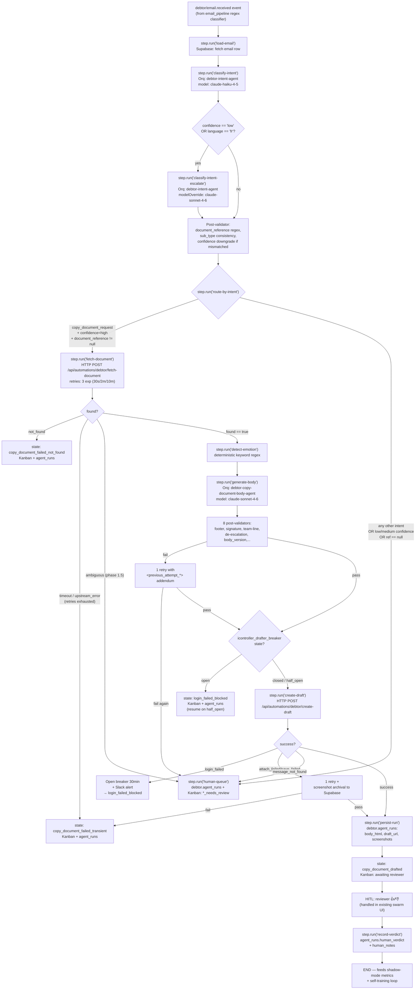

# debtor-email-swarm — Orchestration

## Overview

| Property | Value |
|----------|-------|
| **Orchestration pattern** | `external-orchestration (Inngest)` |
| **Agent count** | 8 (2 fully specified in phase 1, 6 stubs for phase 2+) |
| **Active agents phase 1** | `debtor-intent-agent`, `debtor-copy-document-body-agent` |
| **Complexity justification** | Phase-1 copy-document auto-draft pipeline needs durable retries on a 26s `fetchDocument` tool, circuit-breaker on a Browserless draft-writer, HITL `waitForEvent` hooks for phase-2 sub-agents, and per-step replay caching on `(email_id, body_version)`. Orq.ai `team_of_agents` / `call_sub_agent` wiring does not satisfy any of these requirements. All tool calls run as Inngest `step.run()` TypeScript glue; each Orq agent is a single-shot LLM with no tools. |

> **Pattern deviation from architect default.** This is NOT a standard Orq `parallel-with-orchestrator` swarm. Agent-as-tool / `team_of_agents` is NOT used. Inngest owns orchestration; Orq owns LLM invocations only. See `blueprint.md` §2 for the full rationale.

## Pattern Declaration & Rationale Recap

**Why external orchestration (Inngest) instead of Orq-native multi-agent wiring:**

1. **Durable retries on expensive tools.** `fetchDocument` is p50 ≈ 26s with a 50s internal timeout. Transient upstream errors need Inngest's exponential backoff (30s / 2m / 10m, cap 15 min). An LLM tool-loop retry burns tokens, loses state on cold starts, and has no shared cache across email replays.
2. **Per-step cacheability.** Classification, fetch, body generation, and draft creation are each individually replayable. Cache key `(email_id, intent_version)` for classify and `(email_id, body_version)` for body lets replay-debugging and version-bumps work without re-invoking Browserless or NXT.
3. **HITL `waitForEvent` readiness.** Phase-2 sub-agents (payment-dispute, address-change, etc.) will block on reviewer approval. `step.waitForEvent` is the idiomatic pattern. Orq has no durable wait primitive.
4. **Circuit-breaker on `createDraft`.** iController login failures should pause ALL draft writes for 30 min and Slack-alert. This is infrastructure concern, not an agent concern.
5. **Clean observability.** Orq Analytics tracks LLM calls (tokens, latency, fallback hits). Inngest tracks step timing, retries, and event flow. Supabase `debtor.agent_runs` is the durable truth. Three surfaces joined by `{ email_id, inngest_run_id }` keeps dashboards readable.

**Where this code lives (all absolute to `/Users/nickcrutzen/Developer/agent-workforce/`):**

| Concern | Path |
|---|---|
| Inngest function definition | `web/lib/automations/debtor-email/triage-function.ts` (new) |
| Inngest client + registration | `web/lib/v7/inngest/client.ts` + `web/app/api/inngest/route.ts` |
| fetchDocument API route | `web/app/api/automations/debtor/fetch-document/route.ts` |
| createDraft API route | `web/app/api/automations/debtor/create-draft/route.ts` |
| Emotion-trigger detector | `web/lib/automations/debtor-email/detect-emotion.ts` (new) |
| Orq SDK wrapper | `web/lib/v7/orq/invoke.ts` (new thin wrapper, see §"Inngest Function Signatures") |
| Swarm realtime provider | `web/components/v7/swarm-realtime-provider.tsx` (extend with 5 new kanban states) |
| Kanban page | `web/app/(dashboard)/swarm/[swarmId]/page.tsx` |
| Supabase schema | `supabase/migrations/20260423_debtor_email_labeling.sql` (already exists, extend `debtor.agent_runs`) |

---

## Main Flow (Mermaid)



---

## Inngest Function Signatures (TypeScript pseudo-code)

File: `web/lib/automations/debtor-email/triage-function.ts`

```typescript
import { inngest } from "@/lib/v7/inngest/client";
import { invokeOrq } from "@/lib/v7/orq/invoke";
import { detectEmotion } from "./detect-emotion";
import { NonRetriableError } from "inngest";

export const debtorEmailTriage = inngest.createFunction(
  {
    id: "debtor-email-triage",
    name: "Debtor Email Triage",
    concurrency: [
      { key: "event.data.entity", limit: 2 }, // one running per-entity at a time
    ],
    retries: 3,
  },
  { event: "debtor/email.received" },

  async ({ event, step }) => {
    const { email_id } = event.data;
    const inngest_run_id = event.id;

    // 1) Load email row ------------------------------------------------------
    const email = await step.run("load-email", async () => {
      return supabase
        .from("email_pipeline.emails")
        .select("*")
        .eq("id", email_id)
        .single()
        .then(({ data, error }) => {
          if (error || !data) throw new NonRetriableError("email_not_found");
          return data;
        });
    });

    // 2) Classify intent (Haiku first pass) ---------------------------------
    const variables = sortKeys({
      email_id,
      inngest_run_id,
      stage: "classify",
      subject: email.subject,
      body_text: email.body_text,
      sender_email: email.sender_email,
      sender_domain: email.sender_domain,
      mailbox: email.mailbox,
      entity: email.entity,
      received_at: email.received_at, // logged only, stripped from prompt
    });

    const firstPass = await step.run("classify-intent", async () => {
      return invokeOrq({
        agent: "debtor-intent-agent",
        variables,
        cacheKey: `${email_id}:intent:2026-04-23.v1`, // (email_id, intent_version)
        timeoutMs: 45_000,
      });
    });

    // 3) Hybrid Haiku → Sonnet escalation -----------------------------------
    const needsEscalation =
      firstPass.confidence === "low" || firstPass.language === "fr";

    const classification = needsEscalation
      ? await step.run("classify-intent-escalate", async () => {
          return invokeOrq({
            agent: "debtor-intent-agent",
            variables,
            modelOverride: "anthropic/claude-sonnet-4-6",
            cacheKey: `${email_id}:intent:2026-04-23.v1:sonnet`,
            timeoutMs: 45_000,
          });
        })
      : firstPass;

    // Post-validator (not a step — runs inside the classify step or inline)
    const validated = runIntentPostValidator(classification, email);

    // 4) Route by intent ----------------------------------------------------
    const route = await step.run("route-by-intent", async () => {
      return decideRoute(validated); // returns { kind: "auto" | "human_queue" | "not_supported" }
    });

    if (route.kind !== "auto") {
      await step.run("human-queue", async () => persistHumanQueue(email, validated));
      return { email_id, state: route.kanbanState };
    }

    // 5) Fetch document -----------------------------------------------------
    const fetchResult = await step.run(
      "fetch-document",
      {
        retries: 3,
        // Inngest exp backoff 30s / 2m / 10m, total cap 15min — default
      },
      async () => {
        const r = await fetch(
          `${process.env.VERCEL_URL}/api/automations/debtor/fetch-document`,
          {
            method: "POST",
            headers: {
              Authorization: `Bearer ${process.env.AUTOMATION_WEBHOOK_SECRET}`,
              "Content-Type": "application/json",
            },
            body: JSON.stringify({
              docType: validated.sub_type,
              reference: validated.document_reference,
              entity: email.entity,
            }),
          }
        );
        const json = await r.json();

        if (!r.ok) {
          if (json.reason === "not_found")
            throw new NonRetriableError("fetch_not_found");
          if (json.reason === "invalid_reference_format")
            throw new NonRetriableError("fetch_invalid_ref");
          throw new Error(json.reason ?? "fetch_failed"); // retriable
        }
        if (json.ambiguous) throw new NonRetriableError("fetch_ambiguous");
        return json;
      }
    );

    // 6) Detect emotion (deterministic keyword regex) -----------------------
    const emotion = await step.run("detect-emotion", async () =>
      detectEmotion(email.body_text, validated.language)
    );

    // 7) Generate body ------------------------------------------------------
    const bodyVariables = sortKeys({
      email_id,
      inngest_run_id,
      stage: "generate_body",
      email_subject: email.subject,
      email_body_text: truncateReplyChain(email.body_text),
      email_sender_email: email.sender_email,
      email_sender_first_name: extractFirstName(email),
      email_mailbox: email.mailbox,
      email_entity: email.entity,
      email_language: validated.language,
      intent_result_intent: validated.intent,
      intent_result_sub_type: validated.sub_type,
      intent_result_document_reference: validated.document_reference,
      intent_result_confidence: validated.confidence,
      fetched_document_invoice_id: fetchResult.metadata.invoice_id,
      fetched_document_filename: fetchResult.pdf.filename,
      fetched_document_document_type: fetchResult.metadata.document_type,
      fetched_document_created_on: fetchResult.metadata.created_on,
      body_version: "2026-04-23.v1",
      emotion_trigger_match: emotion.match,
    });

    const body = await step.run("generate-body", async () => {
      const attempt1 = await invokeOrq({
        agent: "debtor-copy-document-body-agent",
        variables: bodyVariables,
        cacheKey: `${email_id}:body:2026-04-23.v1`,
        timeoutMs: 45_000,
      });
      const v1 = runBodyPostValidators(attempt1, bodyVariables);
      if (v1.ok) return attempt1;

      // one retry with prompt addendum signaling prior failure
      const attempt2 = await invokeOrq({
        agent: "debtor-copy-document-body-agent",
        variables: { ...bodyVariables, [v1.addendumKey]: true },
        cacheKey: `${email_id}:body:2026-04-23.v1:retry`,
        timeoutMs: 45_000,
      });
      const v2 = runBodyPostValidators(attempt2, bodyVariables);
      if (!v2.ok) throw new NonRetriableError("body_validation_failed");
      return attempt2;
    });

    // 8) Circuit-breaker check for createDraft ------------------------------
    const breakerOpen = await step.run("check-breaker", async () => {
      const state = await readAutomationState("icontroller_drafter_breaker");
      return state === "open";
    });
    if (breakerOpen) {
      await step.run("human-queue-blocked", async () =>
        persistBlocked(email, validated, body, "login_failed_blocked")
      );
      return { email_id, state: "login_failed_blocked" };
    }

    // 9) Create iController draft -------------------------------------------
    // ⚠️ SWARM-LAUNCH BLOCKER: this step is NOT idempotent on the iController side.
    // The 60s Vercel gateway timeout kills the HTTP response while the browser
    // flow (~2 min) continues and saves the draft server-side. Inngest's
    // `retries: 1` then re-invokes create-draft → second draft for the same
    // email. `login_failed` and `message_not_found` are mapped to NonRetriable,
    // but a network/gateway timeout is neither and falls through to retry.
    //
    // Drafter-side dedup (check automation_runs for prior completed run with
    // matching messageId+filename within TTL) must land before go-live.
    // Tracked: .planning/todos/pending/2026-04-23-create-draft-idempotency-and-cleanup.md
    // Observed: 2026-04-23 E2E verification — HTTP client got empty-reply at 60s,
    // function completed at ~120s and persisted the draft successfully.
    const draft = await step.run(
      "create-draft",
      { retries: 1 },
      async () => {
        const r = await fetch(
          `${process.env.VERCEL_URL}/api/automations/debtor/create-draft`,
          {
            method: "POST",
            headers: {
              Authorization: `Bearer ${process.env.AUTOMATION_WEBHOOK_SECRET}`,
              "Content-Type": "application/json",
            },
            body: JSON.stringify({
              messageId: email.icontroller_message_id,
              bodyHtml: body.body_html,
              pdfBase64: fetchResult.pdf.base64,
              filename: fetchResult.pdf.filename,
              env: "production",
            }),
          }
        );
        const json = await r.json();
        if (!r.ok) {
          if (json.reason === "login_failed") {
            await openBreaker("icontroller_drafter_breaker", 30 * 60 * 1000);
            await slackAlert("iController login failed — breaker open 30min");
            throw new NonRetriableError("login_failed");
          }
          if (json.reason === "message_not_found")
            throw new NonRetriableError("message_not_found");
          // attach_failed / save_failed → retriable once
          await archiveScreenshot(json.screenshot, email_id);
          throw new Error(json.reason);
        }
        return json;
      }
    );

    // 10) Persist + mark drafted -------------------------------------------
    await step.run("persist-run", async () =>
      insertAgentRun({
        email_id,
        intent: validated.intent,
        sub_type: validated.sub_type,
        document_reference: validated.document_reference,
        confidence: validated.confidence,
        tool_outputs: {
          intent_first_pass: firstPass,
          intent_escalated: needsEscalation ? classification : null,
          fetch_result: redactPdf(fetchResult),
          emotion,
          body_detected_tone: body.detected_tone,
          draft_screenshots: draft.screenshots,
        },
        body_html: body.body_html,
        body_version: body.body_version,
        intent_version: "2026-04-23.v1",
        draft_url: draft.draftUrl,
      })
    );

    return {
      email_id,
      state: "copy_document_drafted",
      draft_url: draft.draftUrl,
    };
  }
);
```

**Per-step retry policy summary:**

| step.run | Retries | Backoff | Non-retriable errors |
|---|---|---|---|
| `load-email` | 0 | — | `email_not_found` |
| `classify-intent` | 2 | Orq router internal | Schema validation drift → NonRetriable |
| `classify-intent-escalate` | 2 | Orq router internal | same |
| `route-by-intent` | 0 | — | — |
| `fetch-document` | 3 | exp 30s / 2m / 10m, cap 15 min | `not_found`, `invalid_reference_format`, `ambiguous` |
| `detect-emotion` | 0 | — | deterministic, never fails |
| `generate-body` | 0 outer (1 inner prompt-addendum retry) | — | `body_validation_failed` after both attempts |
| `check-breaker` | 2 | default | — |
| `create-draft` | 1 | default | `login_failed`, `message_not_found` |
| `persist-run` | 3 | default | — |

---

## Routing Matrix (ORCH-02)

Executed inside `step.run("route-by-intent")`. Phase 1: exactly one intent auto-routes.

| `intent` | `confidence` | `document_reference` | Additional condition | Route |
|---|---|---|---|---|
| `copy_document_request` | `high` | non-null | post-validator clean | **AUTO** → `fetch-document` → `generate-body` → `create-draft` |
| `copy_document_request` | `high` | non-null | post-validator downgraded to medium | human queue (`copy_document_needs_review`) |
| `copy_document_request` | `medium` | any | — | human queue |
| `copy_document_request` | `low` | any | — | human queue |
| `copy_document_request` | any | `null` | — | human queue (ref missing, can't fetch) |
| `payment_dispute` | any | any | — | human queue (phase 2 stub: `debtor-payment-dispute-agent`) |
| `address_change` | any | any | — | human queue (phase 2 stub) |
| `peppol_request` | any | any | — | human queue (phase 2 stub) |
| `credit_request` | any | any | — | human queue (phase 2 stub) |
| `contract_inquiry` | any | any | — | human queue (phase 2 stub) |
| `general_inquiry` | any | any | — | human queue (phase 2 stub) |
| `other` | any | any | — | human queue |
| (fetchDocument returns `ambiguous: true`) | — | — | — | human queue (phase 1.5) |

**Rule of thumb:** Phase 1 auto-routes ONLY on the single most-explicit path (`copy_document_request` + `high` + ref). Every other intent — even those with working stubs listed below — sits in the human queue until its sub-agent ships in phase 2.

---

## Hybrid Escalation Logic (Haiku → Sonnet on intent)

From research brief: Haiku-4-5 systematically over-reports `high` confidence and is weaker on francophone-BE AR register. Escalate on `confidence == "low"` OR `language == "fr"` (covers ~3-5% of volume).

**Architectural decision: Inngest-side routing, single Orq agent key, `modelOverride` on invocation.**

```typescript
const first = await step.run("classify-intent", () =>
  invokeOrq({ agent: "debtor-intent-agent", variables })
);

const needsEscalation = first.confidence === "low" || first.language === "fr";

const final = needsEscalation
  ? await step.run("classify-intent-escalate", () =>
      invokeOrq({
        agent: "debtor-intent-agent",
        variables, // SAME variables, same serialized prompt
        modelOverride: "anthropic/claude-sonnet-4-6",
      })
    )
  : first;

// Persist BOTH to agent_runs.tool_outputs for calibration + self-training
```

**Why a single agent key, not a `-v2-fallback` duplicate:**
- Orq catalog stays clean (one `debtor-intent-agent` entry).
- The agent has no tools, so it cannot invoke Sonnet itself (would require agent-as-tool, which this swarm explicitly rejects).
- Inngest owns the decision, retry budget, and trace boundary.
- Both passes share the exact same prompt/schema — escalation is a routing override only.

**Cost envelope:** ~50-150 classifications/day at Haiku tier + ~5-10 escalations/day at Sonnet tier. Under €20/month steady-state.

**Persistence of escalation signal:**
`debtor.agent_runs.tool_outputs.intent_first_pass` and `.intent_escalated` are both stored. Shadow-mode metrics can compare Haiku vs Sonnet agreement over time to validate the escalation threshold.

---

## Error Handling Table

Every error path from `blueprint.md` §2 + `TOOLS.md` + the post-validator specs in the agent files.

| Error path | Origin | Inngest behavior | State written | Human action |
|---|---|---|---|---|
| `email_not_found` | load-email | NonRetriable → fn fails | none (no row to update) | Investigate event source |
| Orq schema validation fail (intent) | classify-intent | NonRetriable after internal retries | `copy_document_needs_review` | Prompt/schema drift alert |
| `intent_version` mismatch | post-validator | 1 retry with cache-bust, then NonRetriable | `copy_document_needs_review` | Version-bump discipline violation |
| `fetch_not_found` | fetch-document | NonRetriable, NO retry | `copy_document_failed_not_found` | Ref likely wrong — human resolves |
| `fetch_invalid_ref` | fetch-document | NonRetriable, NO retry | `copy_document_failed_not_found` | Post-validator should have caught; investigate |
| `fetch_timeout` / `upstream_error` / `fetch_failed` | fetch-document | 3 retries exp 30s / 2m / 10m, cap 15 min | `copy_document_failed_transient` after exhaust | Retry manually after incident clears |
| `fetch_ambiguous` (phase 1.5) | fetch-document | NonRetriable, NO retry | `copy_document_needs_review` | Human disambiguates |
| Body post-validator fail (footer / sig / team-line / de-escalation / body_version) | generate-body | 1 retry with `<previous_attempt_*>true` addendum | `copy_document_needs_review` on 2nd fail | Human reviews, reports drift |
| Body schema validation fail | generate-body | Orq router retries (fallback chain), then NonRetriable | `copy_document_needs_review` | Prompt/model regression |
| `login_failed` | create-draft | **Circuit-breaker opens 30 min + Slack alert** | `login_failed_blocked` | Investigate iController creds; breaker auto-probes at 30 min |
| `message_not_found` | create-draft | NonRetriable, NO retry | `copy_document_needs_review` | Email may have been deleted from iController — human resolves |
| `attach_failed` | create-draft | 1 retry + screenshot archived to Supabase Storage | `copy_document_failed_transient` on 2nd fail | Human checks Browserless screenshot |
| `save_failed` | create-draft | 1 retry + screenshot archived | `copy_document_failed_transient` on 2nd fail | Human checks screenshot; may indicate iController UI change |
| Persist failure | persist-run | 3 retries default | unchanged | Retry-of-last-resort; alert if exhaust |

**Circuit-breaker semantics** (`debtor.automation_state.icontroller_drafter_breaker`):

| State | Behavior |
|---|---|
| `closed` (default) | Normal operation. Every `create-draft` proceeds. |
| `open` | No new `create-draft` calls. Rows sit in `login_failed_blocked`. Auto-transition to `half_open` after 30 min. |
| `half_open` | Next `create-draft` probes. Success → `closed`. Failure → back to `open` for another 30 min + re-alert. |

Manual reset via ops runbook (`web/lib/automations/debtor-email/runbook.md`, to be written): `UPDATE debtor.automation_state SET value = 'closed' WHERE key = 'icontroller_drafter_breaker'`.

---

## State Machine (Kanban Integration)

```mermaid
stateDiagram-v2
    [*] --> classifying: email.received
    classifying --> escalating: low|fr
    classifying --> routing: post-validate OK
    escalating --> routing: post-validate OK
    routing --> fetching: auto-route
    routing --> needs_review_other: other intents
    fetching --> detecting_emotion: found
    fetching --> failed_not_found: not_found
    fetching --> failed_transient: retries exhausted
    fetching --> needs_review_ambiguous: ambiguous
    detecting_emotion --> generating_body
    generating_body --> checking_breaker: validator pass
    generating_body --> needs_review_body_fail: 2nd validator fail
    checking_breaker --> drafting: closed|half_open
    checking_breaker --> blocked: open
    drafting --> drafted: success
    drafting --> failed_transient: attach/save fail x2
    drafting --> blocked: login_failed
    drafting --> needs_review_msg: message_not_found
    drafted --> verdict_approved: human 👍
    drafted --> verdict_rejected: human 👎
    verdict_approved --> [*]
    verdict_rejected --> [*]

    classes {
        fail fill:#fee,stroke:#c33
        queue fill:#fef,stroke:#93c
        success fill:#efe,stroke:#3c3
    }
```

**Terminal kanban states** (mapped to existing swarm page columns):

| State | Kanban column | Source agent_runs row |
|---|---|---|
| `copy_document_drafted` | "Awaiting Reviewer" | happy-path row with `draft_url` |
| `copy_document_needs_review` | "Needs Review" | any `*_needs_review_*` terminal |
| `copy_document_failed_not_found` | "Failed — Not Found" | `tool_outputs.fetch_result.reason = not_found` |
| `copy_document_failed_transient` | "Failed — Transient" | fetch or draft retries exhausted |
| `login_failed_blocked` | "Blocked — Login" | breaker open |

---

## Data Writes to `debtor.agent_runs`

The row is created once on the first step that produces durable data (either `human-queue` or `persist-run`) and UPDATEd incrementally as steps progress. Alternative: INSERT empty row on `load-email`, UPDATE at each step — chosen for replay safety.

| Step | Column(s) written/updated |
|---|---|
| `classify-intent` (+ `-escalate`) | `intent`, `sub_type`, `document_reference`, `confidence`, `intent_version`, `tool_outputs.intent_first_pass`, `tool_outputs.intent_escalated` (nullable), `tool_outputs.language` |
| `fetch-document` | `tool_outputs.fetch_result` (PDF base64 stripped, metadata + filename kept), `tool_outputs.fetch_request_id` |
| `detect-emotion` | `tool_outputs.emotion = { match: bool, matched_keywords: [...] }` |
| `generate-body` | `body_html`, `body_version`, `tool_outputs.body_detected_tone`, `tool_outputs.body_retries` |
| `create-draft` | `draft_url`, `tool_outputs.draft_screenshots = { beforeSave, afterSave }`, `tool_outputs.body_injection_path` |
| `human-queue` / `persist-run` | final `state`, `created_at` (DB default) |
| Later (HITL) | `human_verdict`, `human_notes`, `verdict_set_at` |

Schema reminder (see `blueprint.md` §5 — existing columns plus the ones added in `supabase/migrations/20260423_debtor_email_labeling.sql`):

```sql
email_id           uuid   -- FK → email_pipeline.emails
intent             text
sub_type           text
document_reference text
confidence         text
tool_outputs       jsonb
draft_url          text
body_version       text
intent_version     text
human_verdict      text   -- enum below
human_notes        text
verdict_set_at     timestamptz
created_at         timestamptz default now()
```

`human_verdict` enum: `approved | edited_minor | edited_major | rejected_wrong_intent | rejected_wrong_reference | rejected_wrong_attachment | rejected_wrong_language | rejected_wrong_tone | rejected_other`.

---

## HITL Integration (reviewer feedback flow)

Phase 1 HITL is asynchronous — reviewer opens the iController draft, optionally edits it, clicks send. The swarm UI (see §"Kanban integration") exposes a 👍/👎 control + reason-enum dropdown that writes straight to `debtor.agent_runs.human_verdict` + `human_notes`.

**Flow:**
1. `create-draft` succeeds → state `copy_document_drafted` → row appears in "Awaiting Reviewer" kanban column.
2. Reviewer opens draft in iController (link from `draft_url`), reviews, edits if needed, sends.
3. Reviewer returns to swarm UI and clicks 👍 (approved), 👍-with-note (edited_minor / edited_major), or 👎 + reason.
4. UI `POST`s to `web/app/api/automations/debtor/verdict/route.ts` (new) which UPDATEs `agent_runs.human_verdict, human_notes, verdict_set_at`.
5. `debtor/verdict.recorded` Inngest event fires (same `email_id`). Downstream self-training loop (phase 2) consumes these events to build per-version datasets and flag regressions.

**Dispatch target for phase 2 self-training:**
- `approved` + `edited_minor` → positive training signal.
- `edited_major` + `rejected_*` → negative signal with structured reason feeding prompt-version autotuning. Not in scope phase 1 — recorded only.

**HITL for non-auto-routed intents** (everything in human queue): reviewer sees the raw classification, manually handles the email, and records a verdict on the classification only (no body to review). This is the training signal that unlocks phase-2 stub agents.

---

## Observability

Every Orq invocation carries `variables: { email_id, inngest_run_id, stage }`. These three keys let analytics join across three surfaces:

| Surface | Keys available | What it shows |
|---|---|---|
| **Orq Analytics** | `email_id`, `inngest_run_id`, `stage`, `agent_key`, `model`, `fallback_hit`, `tokens`, `latency_ms` | LLM-level performance, fallback usage, per-language latency, schema-validation drift |
| **Inngest Cloud run timeline** | `event.id` (= `inngest_run_id`), step names, retry counts, exception messages | Orchestration-level flow, retry budget consumption, circuit-breaker events |
| **Supabase `debtor.agent_runs`** | `email_id` (primary), all the durable fields above | Per-email durable truth; source for kanban UI + verdict capture |

**Stage taxonomy** (used in Orq `variables.stage`): `classify | classify_escalate | generate_body`. Matches the Inngest step name prefix 1:1.

**Trace-joining query pattern** (ad-hoc analysis):

```sql
-- All Sonnet-escalated FR classifications in the last 7 days with human verdicts
SELECT
  ar.email_id,
  ar.tool_outputs->'intent_first_pass'->>'confidence'  AS haiku_conf,
  ar.tool_outputs->'intent_escalated'->>'confidence'   AS sonnet_conf,
  ar.tool_outputs->'intent_first_pass'->>'intent'      AS haiku_intent,
  ar.tool_outputs->'intent_escalated'->>'intent'       AS sonnet_intent,
  ar.human_verdict,
  ar.created_at
FROM debtor.agent_runs ar
WHERE ar.tool_outputs->>'language' = 'fr'
  AND ar.tool_outputs->'intent_escalated' IS NOT NULL
  AND ar.created_at > now() - interval '7 days'
ORDER BY ar.created_at DESC;
```

**Trace sampling: 100% on Orq** (low volume, calibration is load-bearing).

---

## Kanban Integration

UI lives in existing `web/app/(dashboard)/swarm/[swarmId]/page.tsx` + components under `web/components/v7/`. This pipeline does NOT ship a new swarm page — the debtor-email-triage Inngest runs register as a new swarm kind (`worker_kind = 'debtor-email-triage'`, see `supabase/migrations/20260422_swarm_agents_worker_kind.sql`).

**Changes required to UI:**

| File | Change |
|---|---|
| `web/components/v7/swarm-realtime-provider.tsx` | Add 5 new kanban states: `copy_document_drafted`, `copy_document_needs_review`, `copy_document_failed_not_found`, `copy_document_failed_transient`, `login_failed_blocked`. Map each to a column + color. |
| `web/lib/v7/swarm-data.ts` | Extend the state→column mapping + icon table. |
| `web/components/v7/kanban/*` | Add verdict control (👍 / 👎 / reason-dropdown) on rows in the `copy_document_drafted` column. |
| `web/app/api/automations/debtor/verdict/route.ts` (new) | POST handler writing `human_verdict`, `human_notes`, `verdict_set_at` + emitting `debtor/verdict.recorded` event. |

Realtime: `debtor.agent_runs` already has Supabase Realtime enabled. The swarm UI subscribes via the existing provider — new states just need rendering.

---

## Phase 2 Extension Plan

When each stub ships, the pattern is the same: new Inngest step-route, new Orq agent key, expanded routing matrix row. No structural changes to the function skeleton.

**`debtor-payment-dispute-agent`** — Triggered by `intent == "payment_dispute"`. Needs a new `step.run("fetch-payment-history")` (NXT SQL via Zapier) before the generation step; generates an empathetic acknowledgement + structured dispute-type tag routed to the debtor-team queue (not iController). Model tier TBD via phase-2 `/orq-agent` re-run. No auto-send; always HITL.

**`debtor-address-change-agent`** — Triggered by `intent == "address_change"`. Needs a new `step.run("validate-address")` (NXT customer lookup + postal validation) before generation. Output is a structured address-change proposal routed to ops for NXT update approval. Haiku-tier sufficient (closed-form acknowledgement). HITL on NXT write.

**`debtor-peppol-request-agent`** — Triggered by `intent == "peppol_request"`. Needs NXT customer-config read to check current Peppol status, then generates a confirmation-or-onboarding-instructions reply. Low complexity; Haiku-tier; single-shot.

**`debtor-credit-request-agent`** — Triggered by `intent == "credit_request"`. Needs `step.run("fetch-credit-context")` (open-invoice lookup + payment history). Higher-risk category — always HITL, never auto-send. Sonnet-tier for empathetic tone.

**`debtor-contract-inquiry-agent`** — Triggered by `intent == "contract_inquiry"`. Needs contract-document lookup via Zapier. Mostly pass-through acknowledgement; Haiku-tier; HITL.

**`debtor-general-inquiry-agent`** — Triggered by `intent == "general_inquiry"`. Lowest-value auto-handling — may remain human-queue-only permanently. If built: Haiku-tier acknowledgement + manual-review handoff. Decide during phase 2 kick-off whether the ROI justifies it at all.

**Routing matrix after phase 2:** each intent gets its own auto-route row. Confidence gate stays at `high` for auto-routes; low/medium continues to human queue. The routing switch in `step.run("route-by-intent")` grows from one case to seven.

**Self-training loop (out of phase 1 but the spec supports it):** the `human_verdict` column + per-agent `*_version` tags let a weekly batch job compute agreement per version and surface regressions. Phase 3 adds the feedback loop that auto-proposes prompt changes from misclassified rows.

---

## Environment Variables

All Inngest/Vercel-side. **No credentials in env vars** (per `CLAUDE.md`: NXT / iController creds live in Supabase `credentials` table).

| Variable | Purpose | Scope |
|---|---|---|
| `AUTOMATION_WEBHOOK_SECRET` | Bearer token for `/api/automations/debtor/fetch-document` and `/create-draft` | Production + Preview + Development |
| `ORQ_API_KEY` | Orq.ai Router key for LLM invocations | All |
| `INNGEST_EVENT_KEY` | Inngest event ingestion | All |
| `INNGEST_SIGNING_KEY` | Inngest webhook signature validation | All |
| `SUPABASE_URL` | Supabase project URL | All |
| `SUPABASE_SERVICE_ROLE_KEY` | Server-side writes to `debtor.agent_runs` + automation_state | **Server only** — never exposed to client |
| `BROWSERLESS_API_TOKEN` | Consumed by `/api/automations/debtor/create-draft` internally | Server only |
| `SLACK_ALERT_WEBHOOK_URL` | Circuit-breaker alerting | Server only |
| `VERCEL_URL` | Self-calling base URL for in-Inngest HTTP tool calls | All (provided by Vercel) |

**Not needed here:** direct LLM provider keys (OpenAI/Anthropic). All LLM calls go through Orq Router.

---

## Setup Steps (Orq.ai Studio + Vercel)

1. **Create `debtor-intent-agent` in Orq Studio** per `agents/debtor-intent-agent.md` §"Deployment Notes" paste-map. Temperature 0, max_tokens 400, `response_format: json_schema strict: true`, 10 variables declared with type+required, 4-entry fallback chain, `sequential_on_error` fallback policy, trace sampling 100%.
2. **Create `debtor-copy-document-body-agent`** per `agents/debtor-copy-document-body-agent.md` §"Deployment Notes". Temperature 0, max_tokens 900, 19 variables, 4-entry fallback chain.
3. **Run `get_agent` on both** via Orq MCP after creation to confirm persisted config (CLAUDE.md mandate).
4. **Deploy Vercel routes:**
   - `web/app/api/automations/debtor/fetch-document/route.ts` (already exists)
   - `web/app/api/automations/debtor/create-draft/route.ts` (already exists)
   - `web/app/api/automations/debtor/verdict/route.ts` (new)
5. **Register Inngest function:**
   - Add `debtorEmailTriage` to `web/lib/v7/inngest/index.ts`
   - Verify it appears in `web/app/api/inngest/route.ts` function list
   - CI runs `inngest-cli deploy` per the `.github/workflows/inngest-sync.yml` backstop (commit `046550a`)
6. **Extend Supabase schema** via `supabase/migrations/20260423_*.sql` migrations (already staged):
   - `debtor.agent_runs` columns
   - `debtor.automation_state` key `icontroller_drafter_breaker`
   - Realtime publication on `debtor.agent_runs`
7. **Extend swarm UI:**
   - `web/components/v7/swarm-realtime-provider.tsx` — 5 new state constants + kanban mapping
   - `web/lib/v7/swarm-data.ts` — state→column + color
8. **End-to-end smoke test in acceptance:**
   - NL happy-path: clean ref → draft in iController with correct footer + team line.
   - EN no-ref: routes to `copy_document_needs_review`.
   - FR ambiguous: Sonnet escalation fires; verdict captured.
   - Emotion-triggered NL: single-sentence de-escalation.
   - Simulated `login_failed` (bad creds): breaker opens, Slack alert, subsequent emails stack in `login_failed_blocked`.
9. **Shadow-mode for 4 weeks** before live-trigger on high-confidence drafts. Metrics per research-brief §"Shadow-mode evaluation plan" (both agents).
10. **Live-trigger gate** — per research brief: intent ≥90% agreement on 200-email batch; body ≥95% approved/edited_minor rate over 4 weeks; ≥3 positive debtor-team reviews; FR manual audit sign-off.

---

## Open items (carried from research brief, flagged for engineering)

1. Validate `mistral/mistral-large-latest` model ID via Orq `list_models` MCP before deploy — workspace may pin a dated version.
2. `fetchDocument.ambiguous` contract extension is phase 1.5; current fetch endpoint does not yet return it — skeleton supports it, but phase-1 ship date does not require it.
3. Entity-signatures Supabase fallback (blueprint open-question #3): confirm iController acceptance auto-appends sig. If not, body-agent `append_signature: true` variable path is needed.
4. Phase-2 language re-detect in body-agent: deferred unless shadow-mode shows language drift.
5. Prompt-version CI check (diff `Agents/debtor-email-swarm/*.md`, fail if prompt changed without `*_version` bump) — owner: @nick, `.github/workflows/prompt-version-check.yml` (new).

---

**End of spec.** This is the authoritative integration blueprint for the debtor-email-swarm phase-1 Inngest function. Next: wave of implementation PRs against `web/lib/automations/debtor-email/`, `web/app/api/automations/debtor/`, and `web/components/v7/*`.
