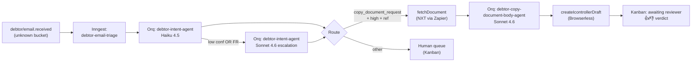

# debtor-email-swarm

**Status:** Phase 1 spec complete · build in progress
**Swarm kind:** `debtor-email-triage` (external-orchestration, Inngest-owned)
**Agents:** 2 fully specified (phase 1) · 6 stubs (phase 2+)

---

## 1. Overview

### Nederlands (primair)

De `debtor-email-swarm` is een AI-zwerm die inkomende debiteuren-e-mails (de mailboxen `debiteuren@smeba.*`, `berki.*`, `sicli-noord.*`, `sicli-sud.*`, `smeba-fire.*`) semi-automatisch verwerkt. De bestaande **regex-classifier** (`web/debtor-email-analyzer/src/classify-copy-requests.ts`) doet de grote schoonmaak op basis van vaste patronen. Alles wat de regex **niet** kan plaatsen — de `unknown`-bucket — gaat naar deze zwerm. De LLM vervangt de regex dus niet, hij vult alleen het gat dat de regex overhoudt.

In **fase 1** doet de zwerm twee dingen: (1) hij kijkt naar elke onbekende e-mail en bepaalt wat de klant wil (intent-classificatie), en (2) als het een verzoek om een **kopie-factuur/werkbon/contract/offerte/creditnota** is én het referentie-nummer is duidelijk, haalt hij het document uit NXT (via Zapier) en zet een **concept-antwoord klaar in iController** met het juiste PDF bijgevoegd. Een medewerker van het debiteurenteam bekijkt het concept in iController, past zo nodig aan, en verstuurt. De zwerm stuurt **nooit zelf** — HITL (human-in-the-loop) blijft gegarandeerd.

In **fase 2** komen er zes extra agents bij voor andere intents (betalingsdisputen, adreswijzigingen, Peppol-verzoeken, credit-verzoeken, contract-vragen, algemene vragen). Die zijn nu alleen als *stub* aanwezig — ze zitten in de routing-matrix maar routeren vooralsnog elke match door naar de menselijke wachtrij.

### English abstract

The `debtor-email-swarm` triages the `unknown` bucket of the regex-based debtor-email classifier. Phase 1 ships two Orq.ai agents: an intent classifier (Haiku-tier, 8-way + reference extraction) and a copy-document body generator (Sonnet-tier, multilingual cover-letter). Orchestration, tool calls (`fetchDocument`, `createIcontrollerDraft`), retries, caching, circuit-breakers, and HITL wiring are owned by an **Inngest function**, not by Orq-native agent-as-tool. Output is a reviewer-ready iController draft — humans always press "send".

### Positioning

```
Inkomende e-mail
     ↓
Regex classifier (bestaand)  ──► copy_request / other vaste categorieën   ──► direct afgehandeld
     ↓
   unknown
     ↓
debtor-email-swarm (NIEUW)   ──► intent + optioneel iController-concept  ──► HITL review
```

De zwerm draait dus op een relatief kleine stroom (geschat 50–150 unknown-e-mails per dag over alle vijf entiteiten), maar precies op de lastige gevallen waar regex geen grip op heeft.

---

## 2. Architecture at a glance



Full orchestration diagram + error-paths + circuit-breaker lives in `ORCHESTRATION.md`. This picture is the elevator version.

Key point: **Orq agents have no tools**. All tool invocations run as Inngest `step.run()` calls. See blueprint.md §2 for rationale (durable retries, replay cache, HITL `waitForEvent`, clean observability).

---

## 3. Agents in this swarm

| Key | Role | Phase | Primary Model | Spec | Dataset |
|-----|------|-------|---------------|------|---------|
| `debtor-intent-agent` | 8-way intent classifier + best-effort reference extraction, multilingual NL/EN/DE/FR | 1 | `anthropic/claude-haiku-4-5-20251001` | [`agents/debtor-intent-agent.md`](agents/debtor-intent-agent.md) | [happy-path](datasets/debtor-intent-agent-dataset.md) · [edge](datasets/debtor-intent-agent-edge-dataset.md) |
| `debtor-copy-document-body-agent` | Generates cover-letter HTML for copy-document replies in sender's language | 1 | `anthropic/claude-sonnet-4-6` | [`agents/debtor-copy-document-body-agent.md`](agents/debtor-copy-document-body-agent.md) | [happy-path](datasets/debtor-copy-document-body-agent-dataset.md) · [edge](datasets/debtor-copy-document-body-agent-edge-dataset.md) |
| `debtor-payment-dispute-agent` | Empathetic acknowledgement + structured dispute tagging | 2 | TBD | [`agents/debtor-payment-dispute-agent.md`](agents/debtor-payment-dispute-agent.md) | — |
| `debtor-address-change-agent` | Address-change proposal + NXT validation handoff | 2 | TBD (likely Haiku) | [`agents/debtor-address-change-agent.md`](agents/debtor-address-change-agent.md) | — |
| `debtor-peppol-request-agent` | Confirm Peppol status or guide onboarding | 2 | TBD (likely Haiku) | [`agents/debtor-peppol-request-agent.md`](agents/debtor-peppol-request-agent.md) | — |
| `debtor-credit-request-agent` | Credit-request acknowledgement with open-invoice context | 2 | TBD (likely Sonnet) | [`agents/debtor-credit-request-agent.md`](agents/debtor-credit-request-agent.md) | — |
| `debtor-contract-inquiry-agent` | Contract-document lookup + reply | 2 | TBD | [`agents/debtor-contract-inquiry-agent.md`](agents/debtor-contract-inquiry-agent.md) | — |
| `debtor-general-inquiry-agent` | Generic acknowledgement — may stay human-only permanently | 2 | TBD | [`agents/debtor-general-inquiry-agent.md`](agents/debtor-general-inquiry-agent.md) | — |

**Both phase-1 agents:** pure LLM, single-shot, no tools, no knowledge base, `response_format: json_schema strict`, temperature 0, 45s client timeout, 4-entry fallback chain, 100% trace sampling.

---

## 4. Prerequisites

Before you can build or run this swarm, confirm:

### Platforms
- [ ] Orq.ai account with access to the MR workspace + project for `debtor-email-swarm`
- [ ] Vercel deployment on the `agent-workforce` project (`prj_APDosWEbpdca53P5UxXst8tCJMVV`, Moyne Roberts org)
- [ ] Inngest Cloud account wired to Vercel production (already live — see commit `046550a`)
- [ ] Supabase project `mvqjhlxfvtqqubqgdvhz` reachable with service-role key

### Vercel env vars
| Name | Purpose |
|------|---------|
| `AUTOMATION_WEBHOOK_SECRET` | Bearer token for `/api/automations/debtor/*` routes |
| `ORQ_API_KEY` | Orq.ai Router key |
| `INNGEST_EVENT_KEY` | Inngest event ingestion |
| `INNGEST_SIGNING_KEY` | Inngest webhook signature validation |
| `SUPABASE_URL` | Supabase URL |
| `SUPABASE_SERVICE_ROLE_KEY` | Server-only writes to `debtor.agent_runs` + `debtor.automation_state` |
| `BROWSERLESS_API_TOKEN` | Consumed by createDraft route |
| `SLACK_ALERT_WEBHOOK_URL` | Circuit-breaker alerting |

No direct LLM provider keys. Everything LLM-side routes through Orq.

### External tools (already deployed)
| Tool | Status | Path |
|------|--------|------|
| `fetchDocument` | Tested 2026-04-23 (`.planning/todos/pending/2026-04-22-tool-fetch-document-nxt-via-zapier-sdk.md`) | `web/app/api/automations/debtor/fetch-document/route.ts` |
| `createIcontrollerDraft` | Deployed, E2E verification pending | `web/app/api/automations/debtor/create-draft/route.ts` |

### Supabase credentials
Entries in the `credentials` table for the iController drafter session (acceptance + production, environment-scoped). See `CLAUDE.md` for the query pattern.

### Upstream signal
The existing regex classifier must be producing the `unknown` bucket. The swarm is the downstream consumer — no unknown = no traffic.

---

## 5. Setup steps

Work through these in order. Non-technical steps are flagged; technical steps assume Vercel/Inngest/Supabase familiarity.

### 5.1 — Create the two Orq.ai agents *(non-technical, Orq Studio UI)*

1. Log in to [studio.orq.ai](https://studio.orq.ai), open the MR workspace.
2. Go to **Agents → Create Agent**. Name it `debtor-intent-agent`.
3. Open `agents/debtor-intent-agent.md`. It has a **Deployment Notes / paste-map** section with every field:
   - Key, Role, Description, Version tag
   - Model (primary) + 4 fallback models in order
   - Temperature, max_tokens, `response_format` (paste the full JSON-schema block)
   - The **Instructions** (system prompt) — paste the entire block under "Prompt"
   - 10 declared `variables` with `type` + `required`
   - Tools: **none**
   - Knowledge base: **none**
   - Memory: **none**
   - Trace sampling: 100%
   - Fallback policy: `sequential_on_error`
4. Save the agent. Then run `get_agent` via the Orq MCP to **verify** the persisted configuration matches the spec (CLAUDE.md mandates this — `update_agent` without verification is not done).
5. Repeat the full flow for `debtor-copy-document-body-agent` using `agents/debtor-copy-document-body-agent.md`. 19 variables this time, temperature 0, max_tokens 900.

### 5.2 — Configure the fallback chains

Both agents have a **4-entry** fallback chain (CLAUDE.md mandates 3–4). Confirm in Orq that:

- Policy is `sequential_on_error` (not `parallel`) — Orq silently changed default behaviour in Q1 2026 release notes.
- Exponential backoff is enabled between fallbacks.
- Order is exactly as listed in the spec file — the 4th entry (`mistral/mistral-large-latest`) is load-bearing for FR/BE-Dutch tail resilience.

### 5.3 — Upload the 4 datasets to Orq Datasets *(Orq Studio UI)*

1. Navigate to **Datasets → Create Dataset** in Orq Studio.
2. Create **four** datasets:
   - `debtor-intent-agent-happy` ← [`datasets/debtor-intent-agent-dataset.md`](datasets/debtor-intent-agent-dataset.md)
   - `debtor-intent-agent-edge` ← [`datasets/debtor-intent-agent-edge-dataset.md`](datasets/debtor-intent-agent-edge-dataset.md)
   - `debtor-copy-document-body-agent-happy` ← [`datasets/debtor-copy-document-body-agent-dataset.md`](datasets/debtor-copy-document-body-agent-dataset.md)
   - `debtor-copy-document-body-agent-edge` ← [`datasets/debtor-copy-document-body-agent-edge-dataset.md`](datasets/debtor-copy-document-body-agent-edge-dataset.md)
3. Each dataset file is a Markdown document with one JSON datapoint per test case — copy them over via the Orq MCP `create_datapoints` tool, or paste manually.
4. Run the happy-path dataset against each agent in Orq Studio's **Playground** before wiring Inngest. All cases should return schema-valid JSON.

### 5.4 — Verify `response_format` + variables contract

In Orq Studio:

- Open each agent → **Schema** tab → confirm the JSON-schema block matches the spec's `response_format.json_schema` exactly (property-by-property, `additionalProperties: false`, `required` array complete).
- Open **Variables** tab → each declared variable has the correct `type` + `required` flag. Orq will reject malformed inputs at ingress (saves tokens on bad Inngest calls).
- Run one synthetic invocation from the Playground to sanity-check end-to-end.

### 5.5 — Wire the Inngest function

Implementation reference: `ORCHESTRATION.md` §"Inngest Function Signatures" (full TypeScript skeleton).

1. Create `web/lib/automations/debtor-email/triage-function.ts` with the `debtorEmailTriage` function from ORCHESTRATION.md.
2. Create `web/lib/v7/orq/invoke.ts` — thin Orq SDK wrapper (agent key + variables + `modelOverride` + `cacheKey` + 45s timeout).
3. Create `web/lib/automations/debtor-email/detect-emotion.ts` — deterministic keyword regex (NL/EN/DE/FR) per the body-agent spec.
4. Register the function in `web/lib/v7/inngest/index.ts` and confirm it appears in `web/app/api/inngest/route.ts` function list.
5. `inngest-cli deploy` runs automatically after merge via `.github/workflows/inngest-sync.yml` backstop (commit `046550a`).

### 5.6 — Extend the swarm kanban UI

The existing swarm UI (`web/app/(dashboard)/swarm/[swarmId]/page.tsx`) already supports per-swarm realtime. Extend it with the 5 new states:

| File | Change |
|------|--------|
| `web/components/v7/swarm-realtime-provider.tsx` | Add `copy_document_drafted`, `copy_document_needs_review`, `copy_document_failed_not_found`, `copy_document_failed_transient`, `login_failed_blocked` |
| `web/lib/v7/swarm-data.ts` | State→column mapping + icon + colour |
| `web/components/v7/kanban/*` | Add the 👍/👎 verdict control on rows in the "Awaiting Reviewer" column |
| `web/app/api/automations/debtor/verdict/route.ts` (new) | POST handler writing `human_verdict`, `human_notes`, `verdict_set_at` + emitting `debtor/verdict.recorded` Inngest event |

### 5.7 — Provision the `debtor.agent_runs` Supabase table

Schema in `blueprint.md` §5. The migration is already staged:

```
supabase/migrations/20260423_debtor_email_labeling.sql
```

It creates/extends:
- `debtor.agent_runs` (all columns)
- `debtor.automation_state` with key `icontroller_drafter_breaker` (default `closed`)
- Realtime publication on `debtor.agent_runs`

Confirm the `human_verdict` enum includes all 9 values: `approved | edited_minor | edited_major | rejected_wrong_intent | rejected_wrong_reference | rejected_wrong_attachment | rejected_wrong_language | rejected_wrong_tone | rejected_other`.

### 5.8 — Enable shadow-mode gate

**Critical before first live run.** Add a feature flag (`DEBTOR_SWARM_LIVE_DRAFT = false`) checked inside `step.run("create-draft")`:

- When `false` (shadow mode): skip the iController POST, write the body_html + would-be draft_url into `agent_runs`, mark state `copy_document_drafted` so the reviewer still sees it in kanban — but no actual iController draft is created.
- When `true`: call `createIcontrollerDraft` normally.

This lets the 4-week validation run collect verdicts without touching production iController. Flip the flag only after the go/no-go gate in §6.

---

## 6. Running shadow mode

### What gets measured

From research-brief.md §"Shadow-mode evaluation plan" and §8:

**Intent agent (weekly):**
- Overall intent agreement rate (target ≥90% on 200-email control)
- Per-confidence-bucket agreement: `high` ≥95%, `medium` 80–90%, `low` free
- `document_reference` extraction **precision** ≥98% (false-positive = hallucinated ref)
- `document_reference` extraction **recall** on `copy_document_request` ≥85%
- Per-language agreement (NL must hit target; DE/FR audited manually due to small sample)

**Body agent (weekly):**
- Human verdict distribution: `approved` + `edited_minor` = success, target ≥95% sustained over 4 weeks
- Footer-validator rejection rate (should be <1%; >5% means prompt regression)
- Signature-validator rejection rate (should be <2%)
- Per-language verdict distribution, FR/DE audited individually

**Qualitative gate:** at least **3 positive reviews** from the debtor team ("dit scheelt me tijd", "concept was goed") before flipping the live-draft flag.

### Where to see results

| Surface | URL | What it shows |
|---------|-----|---------------|
| Existing swarm kanban page | `/swarm/debtor-email-triage` | Live rows, per-email verdicts, reviewer actions |
| Orq Analytics | Orq Studio → Analytics | Per-agent latency, token spend, fallback-hit rate, schema-validation drift |
| Inngest Cloud | Inngest dashboard | Step timing, retry counts, circuit-breaker events |
| Supabase `debtor.agent_runs` | Direct SQL | Durable truth; source for weekly calibration queries |

Cross-surface trace-joining key: `{ email_id, inngest_run_id, stage }` (passed on every Orq invocation).

### How to label

The kanban UI shows each drafted email with:
- 👍 **Approved** — sent as-is
- 👍 **Edited (minor)** — small tweaks, agent mostly right
- 👎 **Edited (major)** — significant rewrite
- 👎 **Rejected** + reason-enum: `wrong_intent | wrong_reference | wrong_attachment | wrong_language | wrong_tone | other`
- Optional free-text note

All verdicts land in `debtor.agent_runs.human_verdict` + `.human_notes` + `.verdict_set_at`. The verdict triggers a `debtor/verdict.recorded` Inngest event for future self-training (phase 2+).

### Go/no-go criteria for the production switch

Flip `DEBTOR_SWARM_LIVE_DRAFT = true` only when **all** of the following hold over a rolling 4-week window:

1. Intent agreement ≥90% overall on the 200-email control set
2. Intent `high`-confidence bucket ≥95% agreement
3. `document_reference` precision ≥98%
4. Body agent `approved`+`edited_minor` ≥95%
5. Footer-validator rejection rate <5%
6. ≥3 positive debtor-team verdicts captured in `human_notes`
7. FR manual audit sign-off (every FR case reviewed individually due to small sample)
8. No unresolved `login_failed_blocked` incidents in the last 7 days

---

## 7. Voor het debiteurenteam

*Dit hoofdstuk is voor debiteuren-medewerkers die de concepten gaan beoordelen. Je hoeft niks van AI of code te weten.*

### Wat verandert er voor jou?

Vanaf nu komen er **concept-antwoorden** klaar in iController voor e-mails die gaan over een kopie van een factuur, werkbon, contract, offerte of creditnota. Het concept heeft het goede PDF er al bij en de tekst staat er al. Jij hoeft alleen nog:

1. Het concept openen in iController
2. Snel lezen of het klopt
3. Eventueel aanpassen (typefout, andere toon, extra zin)
4. Op **Versturen** klikken — de zwerm verstuurt nooit zelf

Voor andere soorten e-mails (betalingsdispuut, adreswijziging, Peppol, etc.) verandert er nu nog niks — die blijven als vanouds in je mailbox staan. Die komen in een latere fase.

### Hoe herken ik een agent-concept?

Elk agent-concept heeft onderaan een **voettekst in monospace-lettertype** met grijze tekst:

```
intent: copy_document_request
confidence: high
ref: F2025-01234
body_version: 2026-04-23.v1
email_id: 7b3c...
```

Deze voettekst is er voor jou — zodat je in één oogopslag ziet dat dit een agent-concept is en met welke informatie het gegenereerd is. **Verwijder deze voettekst voordat je verstuurt.**

Een handtekening schrijft de agent **nooit**. Die plakt iController er zelf onder. Als je toch een "Met vriendelijke groet" ziet in de tekst die jij moet verzenden: melden (zie hieronder — reden `wrong_tone`).

### Hoe geef ik feedback?

Open het **Swarm Dashboard** → `Debtor Email Triage`. Voor elk concept dat je hebt beoordeeld klik je:

| Knop | Wanneer |
|------|---------|
| 👍 **Goedgekeurd** | Verstuurd zonder wijzigingen |
| 👍 **Kleine aanpassing** | Één typefout, een woord anders, verder prima |
| 👎 **Grote aanpassing** | Hele zinnen herschreven, toon compleet anders |
| 👎 **Afgewezen** | Kon er niks mee, heb zelf een nieuw antwoord getypt |

Bij een 👎 kies je een reden uit het dropdownmenu:

| Reden | Betekenis |
|-------|-----------|
| `wrong_intent` | De zwerm dacht dat het iets anders was (géén kopie-verzoek bijvoorbeeld) |
| `wrong_reference` | Het factuurnummer klopte niet |
| `wrong_attachment` | De verkeerde PDF was bijgevoegd |
| `wrong_language` | Antwoord in NL terwijl klant FR schreef, of andersom |
| `wrong_tone` | Te formeel / te informeel / onhandig, signature block erin, etc. |
| `other` | Iets anders — vul het notities-veld in |

Alle feedback wordt opgeslagen en elke week bekeken. Het is **essentieel** voor de kwaliteit — zonder jouw verdicts weten we niet of de zwerm goed werkt.

### Wat doet de agent NIET?

- De agent **verstuurt nooit zelf**. Elk concept wacht op jouw klik.
- De agent doet **geen** betalingsafspraken, **geen** kwijtscheldingen, **geen** toezeggingen die geld kosten.
- De agent raakt **geen NXT-data** aan — lees-alleen.
- De agent beantwoordt alleen e-mails waarvan hij **hoog** zeker is dat het om een kopie-verzoek gaat én waarvan het referentie-nummer duidelijk is. Alle andere gevallen komen in de "Needs Review"-kolom en worden **niet** beantwoord door de agent — die handel jij handmatig af zoals vroeger.

---

## 8. Maintenance & iteration

### Prompt-versioning discipline

Every prompt change bumps the version tag:
- `intent_version` in `debtor-intent-agent.md` (format `YYYY-MM-DD.vN`)
- `body_version` in `debtor-copy-document-body-agent.md`

Both tags are:
1. Stored as literal strings inside the prompt itself (so Orq traces capture them)
2. Echoed back in the agent's JSON output
3. Persisted to `debtor.agent_runs.intent_version` / `body_version`
4. Used as the Inngest step `cacheKey` suffix

**Enforcement:** CI check (`.github/workflows/prompt-version-check.yml`, to be written — owner @nick). Diffs files under `Agents/debtor-email-swarm/`. If `<role>`, `<constraints>`, or few-shot sections changed but the version string didn't: CI fails. Typo/whitespace opt-out via `[skip-version]` commit tag.

### Weekly Orq experiments

Every Monday:
1. Pull last 7 days of `debtor.agent_runs` rows with verdicts.
2. Filter disagreements (`rejected_*` or `edited_major`).
3. Add the disagreements to the relevant dataset file (`*-edge-dataset.md`).
4. Run an Orq **Experiment** (`create_experiment` MCP) comparing current prompt-version against a candidate prompt variant.
5. If the candidate wins on dataset + doesn't regress on happy-path: bump version, commit, deploy.

### Self-training loop

Tracked separately in `.planning/todos/pending/` — the loop consumes `debtor/verdict.recorded` events to auto-propose prompt changes. Out of scope for phase 1; the data model supports it from day one.

### Known edge cases + workarounds

| Case | Workaround |
|------|-----------|
| **Ambiguous invoice_id** (multiple matches in NXT) | `fetchDocument.ambiguous: true` → Inngest routes to human queue. Phase 1.5 feature — endpoint extension needed first. |
| **iController login failure** | Circuit-breaker opens 30 min + Slack alert. All pending drafts wait in `login_failed_blocked`. Breaker auto-probes after 30 min. Manual reset: `UPDATE debtor.automation_state SET value = 'closed' WHERE key = 'icontroller_drafter_breaker'`. |
| **Haiku overconfidence on short NL inputs** | Anti-overconfidence rubric baked into prompt. Hybrid Haiku→Sonnet escalation on `confidence=low` OR `language=fr`. |
| **Body agent writes signature block** | Post-validator regex rejects `mvg|met vriendelijke groet|kind regards|cordialement|mit freundlichen` outside the `<pre>` footer. One retry with addendum, then human queue. |
| **Reply-chain bloat** | `truncateReplyChain()` in Inngest pre-step strips quoted history before passing to body agent. |
| **Language drift** (body responds NL for FR email) | Phase 1: `email.language` from intent-agent is trusted. If shadow mode shows drift >2%, add a language-confirmation regex pre-step. Phase 2: body-agent re-detects. |

---

## 9. Phase 2 roadmap

Stubs live in `agents/*.md` with trigger + input sketch. When each ships, the pattern is identical: new Inngest step-route, new Orq agent, expanded routing-matrix row.

| Stub | Trigger intent | New Inngest steps | Risk | Tier |
|------|---------------|-------------------|------|------|
| `debtor-payment-dispute-agent` | `payment_dispute` | `fetch-payment-history` (NXT SQL via Zapier) | High — never auto-send | Sonnet |
| `debtor-address-change-agent` | `address_change` | `validate-address` (NXT lookup + postal check) | Medium — HITL on NXT write | Haiku |
| `debtor-peppol-request-agent` | `peppol_request` | NXT customer-config read | Low | Haiku |
| `debtor-credit-request-agent` | `credit_request` | `fetch-credit-context` (open-invoice + payment history) | High — always HITL | Sonnet |
| `debtor-contract-inquiry-agent` | `contract_inquiry` | Contract-document lookup via Zapier | Low | Haiku |
| `debtor-general-inquiry-agent` | `general_inquiry` | — | Low value, may stay human-only permanently | Haiku |

Phase-2 kick-off re-runs `/orq-agent` per stub with actual labeled data from phase-1 shadow mode as input.

---

## 10. Troubleshooting

| Symptom | Likely cause | Fix |
|---------|--------------|-----|
| Intent agent returns `confidence: high` on >85% of traffic | Anti-overconfidence rubric not being honoured — prompt-regression. | Review the `<constraints>` block in the agent spec; the rubric MUST include "When uncertain between two confidence levels, choose the lower one." Bump `intent_version`, re-run experiment on dataset. |
| Body missing the monospace footer | Sonnet prompt drift; post-validator should have caught. | Check Inngest `generate-body` step logs — if the second attempt also failed, row is already in `copy_document_needs_review`. Bump `body_version` and add a footer example to few-shot. |
| Circuit-breaker stuck `open` beyond 30 min | Auto-probe step failed again; breaker re-opened. | Check iController credentials in Supabase `credentials` table. Manual reset via `UPDATE debtor.automation_state SET value = 'closed' WHERE key = 'icontroller_drafter_breaker'`. Re-run a single email before un-blocking the queue. |
| Response language ≠ sender language | Intent-agent mislabelled `language`. Phase 1 does not re-detect. | Check `debtor.agent_runs.tool_outputs->intent_first_pass->language`. If persistently wrong for one entity, tighten language rule in intent-agent prompt; phase 2 adds re-detection in body-agent. |
| FR cases all fail body validation | Sonnet FR few-shot too thin. | Add 2 more FR few-shot examples to body-agent prompt (owner: @nick + Sicli-Sud contact for native review). Bump `body_version`. |
| `fetch_invalid_ref` errors spiking | Intent-agent hallucinating references. | Check `document_reference` precision in weekly metrics. Tighten the "digit-string only, VERBATIM from email" rule in the anti-hallucination anchor. |
| `persist-run` retries exhausting | Supabase service-role key rotated or RLS misconfigured. | Verify `SUPABASE_SERVICE_ROLE_KEY` in Vercel env vars. Check `supabase/migrations/20260422_enable_rls_email_tables.sql` — service role should bypass RLS. |
| Orq agent not found after deploy | Agent key typo or wrong workspace. | Run `get_agent` via Orq MCP with exact key. Confirm workspace matches `ORQ_API_KEY` scope. |

---

## 11. References

### In-repo
- [`blueprint.md`](blueprint.md) — architect output: swarm scope, agent roster, data model, job states
- [`research-brief.md`](research-brief.md) — model choice rationale, prompt strategies, multilingual notes, shadow-mode plan
- [`ORCHESTRATION.md`](ORCHESTRATION.md) — full Inngest function signature, routing matrix, error-handling table, observability
- [`TOOLS.md`](TOOLS.md) — external tool contracts (`fetchDocument`, `createIcontrollerDraft`) for engineering reference
- [`agents/debtor-intent-agent.md`](agents/debtor-intent-agent.md) — full paste-ready spec
- [`agents/debtor-copy-document-body-agent.md`](agents/debtor-copy-document-body-agent.md) — full paste-ready spec
- [`datasets/*.md`](datasets/) — test datapoints (happy + edge) per agent
- [`../../CLAUDE.md`](../../CLAUDE.md) — MR Automations codebase conventions (Orq.ai patterns, credentials, test-first)
- [`../../.planning/briefs/2026-04-23-debtor-email-swarm-brief.md`](../../.planning/briefs/2026-04-23-debtor-email-swarm-brief.md) — original project brief

### External
- [Orq.ai Studio](https://studio.orq.ai) — agent + dataset management
- [Orq.ai docs — response_format](https://docs.orq.ai) — JSON-schema strict mode
- [Inngest docs — step.run + step.waitForEvent](https://www.inngest.com/docs) — durable orchestration primitives
- [Browserless.io](https://www.browserless.io) — headless Chromium for iController drafter

### Related PRs / commits
- `046550a` — Inngest sync backstop
- `48f805d` — Browserless session hard-cap
- `2728778` — icontroller reusable session layer

---

**Owner:** @nick · **Last updated:** 2026-04-23 · **Phase:** 1 (spec complete, build in progress)
