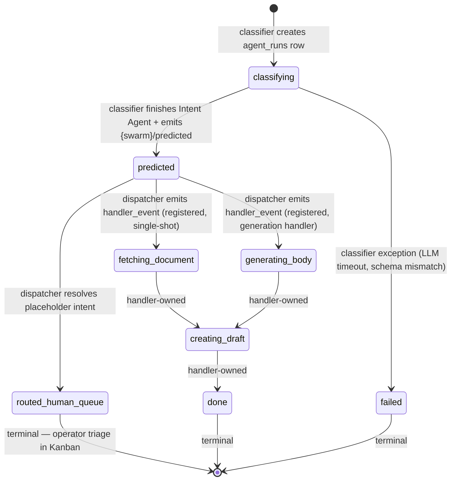

# Stage 3 -- Intent Classifier + Stage 3.5 Dispatcher (Cross-Swarm)

> **Status:** RFC. Originally Phase 63 (ranked-intent coordinator). **Last revised: 2026-05-08 (Phase 80)** — split monolithic coordinator into Stage 3 *classifier* + Stage 3.5 *dispatcher*; `predicted` is now a first-class observable `agent_runs.status`.

## Goal

Take a `PipelineStageContext` from Stage 2 and produce a **ranked intent list** (CORD-01) ordered descending by confidence. Stage 3 is now strictly a **classifier**: it persists ranked intents, flips `agent_runs.status` from `classifying` → `predicted`, and emits a `<swarm_type>/predicted` event. **All dispatch (single-shot, placeholder Kanban, low-confidence Kanban, future fan-out) lives in Stage 3.5 — the dispatcher.** A row in `predicted` is awaiting dispatcher action; a row in `routed_human_queue` is the terminal placeholder-intent state.

The dispatcher is **swarm-agnostic by construction** (single Inngest function, wildcard `*/predicted` trigger). Phase 76's escalation gate (single decision point per D-09) lives in the dispatcher; the function stays pure, only the call site moves.

## Anthropic Pattern Mapping

Stage 3 sits inside Anthropic's prompt-chaining pattern (`https://www.anthropic.com/engineering/building-effective-agents`): Stage 2's structured output feeds the classifier, the classifier produces a ranked intent list, the dispatcher gates Stage 4 dispatch. The Stage 3.5 orchestrator-worker fan-out — Anthropic's orchestrator-worker pattern for cases where single-shot cannot cleanly synthesise the answer — remains a **dormant re-enable seam** in the dispatcher (Phase 76 D-07 deferred indefinitely).

## Architecture

```
PipelineStageContext (from Stage 2)
        ↓
┌──────────────────────────────────┐
│ STAGE 3 CLASSIFIER               │
│ (per-swarm Inngest function)     │
│                                  │
│  • Intent Agent (LLM, ranked)    │
│  • persist coordinator_runs      │
│  • flip agent_runs.status:       │
│      classifying → predicted     │
│  • emit `<swarm>/predicted`      │
└────────┬─────────────────────────┘
         │  Inngest event
         │  `<swarm_type>/predicted`
         ↓
┌──────────────────────────────────┐
│ STAGE 3.5 DISPATCHER             │
│ (single function, all swarms,    │
│  wildcard `*/predicted` trigger) │
│                                  │
│  • loadSwarmIntents(swarm_type)  │
│  • escalation gate (pure fn)     │
│  • route by handler_status:      │
└────────┬─────────────────────────┘
         ↓
   ┌─────┴─────────────────────────────────────────┐
   │                                               │
   ↓ (handler_status='registered')                ↓ (handler_status='placeholder')
emit handler_event                       INSERT automation_runs (Kanban)
Stage 4 handler owns                     flip agent_runs.status:
agent_runs.status from here              predicted → routed_human_queue
                                         (terminal — human triage)
```

## Input Contract

Stage 3 (classifier) consumes `PipelineStageContext` per [`./context-shape-contract.md`](./context-shape-contract.md). This document does not duplicate the TypeScript interface.

## Output: Ranked Intent List

Per CORD-01, the classifier emits a list of `{intent, confidence}` objects ordered by confidence descending. The full ranked list is persisted on `coordinator_runs.ranked_intents`. The top intent — and the dispatcher's resolved `swarm_intents` row — drives Stage 4 dispatch. The full ranked list is also persisted (Phase 70 `pipeline_events`) so eval logic and the Bulk Review surface can score the ranking, not just the top pick.

Implementation pattern: Orq.ai LLM Router with `response_format: json_schema` enforcing the ranked-list shape; primary model + fallbacks per CLAUDE.md catalog rules; XML-tagged prompts; 45s client timeout. See [`../orqai-patterns.md`](../orqai-patterns.md) — this document does not duplicate those rules.

## State Machine

A single `agent_runs` row's `status` field traces the row's life through Stage 3 + 3.5. `predicted` is a **first-class observable state** as of Phase 80 — no longer a transient checkpoint hidden inside the coordinator function.



**Ownership rule:** the **classifier** writes `classifying` and `predicted` (and `failed` on its own exception); the **dispatcher** writes `routed_human_queue`; the **Stage 4 handler** owns every status reachable from `predicted` other than `routed_human_queue` / `failed`. Classifier and dispatcher never touch handler-owned statuses.

## Transition Table

| From               | To                       | Writer              | Trigger                                                              |
| ------------------ | ------------------------ | ------------------- | -------------------------------------------------------------------- |
| (none)             | `classifying`            | classifier          | Row creation at start of Stage 3 (caller-provided or `createRun`).   |
| `classifying`      | `predicted`              | classifier          | Intent Agent success — `coordinator_runs.ranked_intents` persisted, race-guarded `.eq('status','classifying')` flip, then `inngest.send({name: '<swarm>/predicted', ...})`. |
| `classifying`      | `failed`                 | classifier          | Classifier-side exception (LLM timeout, schema validation error, Supabase write error). Caught in the function's catch block; `automation_runs` may also be marked failed. |
| `predicted`        | `routed_human_queue`     | dispatcher          | `swarm_intents.handler_status = 'placeholder'` for the picked intent. Inside one atomic `step.run`: insert `automation_runs` Kanban row + flip status (race-guarded `.eq('status','predicted')`) + mark `coordinator_runs.completed_at` + emit realtime stale-broadcast. |
| `predicted`        | handler-owned status     | Stage 4 handler     | `swarm_intents.handler_status = 'registered'`. Dispatcher emits `swarm_intents.handler_event`; the handler picks up and flips status (e.g. `fetching_document`). Dispatcher does **not** write `agent_runs.status` on this branch. |
| handler-owned      | handler-owned / `done`   | Stage 4 handler     | Out of RFC scope — see per-handler runbook. |

## Stuck-Status Meaning (Monitoring)

The classifier/dispatcher split makes `agent_runs.status` the operational health signal for Stage 3. Two distinct stuck-status alerts replace the legacy "stuck in classifying" catch-all.

| Status stuck for                | Meaning                                                                                    | Action                                                                                                                              |
| ------------------------------- | ------------------------------------------------------------------------------------------ | ----------------------------------------------------------------------------------------------------------------------------------- |
| `classifying` > 5 min           | Classifier bug or LLM outage — Intent Agent did not return, or the post-LLM flip failed.   | **Page.** Check Inngest dashboard for `automations/debtor-email-coordinator` (or the per-swarm classifier function) failures.       |
| `predicted` > 5 min             | Dispatcher bug or Inngest delivery delay — `<swarm>/predicted` emitted but never dispatched. | **Page.** Check Inngest dashboard for `automations/stage-3-dispatcher`; verify wildcard `*/predicted` subscription is healthy.       |
| `routed_human_queue` indefinitely | Expected human lane — placeholder intent waiting for operator triage in Kanban.            | **No alert.** This is the terminal state for placeholder intents.                                                                   |
| handler-owned status > N min    | Stage 4 handler bug — registered handler picked up the event but stalled.                  | Per-handler runbook (out of this RFC's scope). Distinct from dispatcher stall: dispatcher stall = `predicted`, handler stall ≠ `predicted`. |

### SQL Health Queries

Run periodically (e.g. as an Inngest cron or Supabase scheduled function) and alert on non-zero counts:

```sql
-- Classifier-stuck rows (page if > 0)
SELECT id, swarm_type, email_id, created_at
FROM agent_runs
WHERE status = 'classifying'
  AND created_at < now() - interval '5 minutes';

-- Dispatcher-stuck rows (page if > 0)
SELECT id, swarm_type, email_id, created_at
FROM agent_runs
WHERE status = 'predicted'
  AND created_at < now() - interval '5 minutes';
```

> **Footnote — post-backfill steady state.** Pre-Phase-80 there were ~407 stranded `classifying` rows in production accumulated over ~9 days, all with `tool_outputs.intent_first_pass` populated and a matching `{swarm}-kanban` `automation_runs` row — the classifier finished, the work was queued for human triage, but the status flip never landed because dispatch lived inside the same function and silently swallowed errors. These rows were resolved by `web/scripts/backfill-stuck-classifying-stage3.ts` (Phase 80 Plan 05, run 2026-05-08) which flipped `HAS_KANBAN`-bucket rows to `routed_human_queue` under a race-guarded `.eq('status','classifying')` UPDATE. **Steady-state baseline = 0 stranded `classifying` rows.** Any non-zero count from the first SQL above is anomalous and pages immediately.

## Cross-Swarm Dispatcher Contract

The Stage 3.5 dispatcher is the **single seam** through which every swarm's classifier output reaches Stage 4. New swarms onboard through registry rows + a per-swarm classifier function, **never** by editing dispatcher code.

- **Subscription pattern:** Inngest **wildcard trigger** `{ event: "*/predicted" }` on a single function (`web/lib/inngest/functions/stage-3-dispatcher.ts`, id `automations/stage-3-dispatcher`). One function fans in across all swarms — verified against Inngest docs (`inngest.com/docs/guides/multiple-triggers`).
- **Event name format:** `{swarm_type}/predicted` (lowercase, hyphenated `swarm_type` matching the `public.swarms.swarm_type` PK — e.g. `debtor-email/predicted`, `sales-email/predicted`).
- **Event payload schema** (carried inline so the dispatcher does not re-query the classifier-written rows):
  - `swarm_type: string` — duplicate of name prefix; convenience for SQL/registry lookup
  - `run_id: string` — `coordinator_runs` PK
  - `agent_run_id: string` — `agent_runs` PK (the row currently in `predicted`)
  - `email_id: string`
  - `automation_run_id: string | null`
  - `budget_run_id: string | null`
  - `ranked: RankedIntentEntry[]` — top-N intents, dispatcher reads top-1 for routing
  - `language: string`
  - `urgency: string`
  - `entity: Entity | null` — null for swarms without `entity_brand`
- **Routing source-of-truth:** `public.swarm_intents (swarm_type, intent_key) → handler_status, handler_event, requires_orchestration`. The dispatcher calls `loadSwarmIntents(admin, swarm_type)` (Phase 68 helper) — zero hardcoded swarm names anywhere in dispatcher code.
- **Adding a new swarm:**
  1. INSERT a `public.swarms` row.
  2. INSERT `public.swarm_intents` rows (one per intent, with `handler_status` set to `placeholder` until a Stage 4 handler ships).
  3. INSERT the small noise-key set into `public.swarm_noise_categories` (Stage 1 only).
  4. Implement a per-swarm classifier Inngest function that emits `<swarm_type>/predicted` with the payload above.

  **No dispatcher code change.** The wildcard trigger and registry-driven routing handle the new swarm on the first event.

### Hard-Separation Lock (RFC-locked, restated for the dispatcher)

The dispatcher reads **`swarm_intents` only**. It must **never** query, import, or mock `swarm_noise_categories`. Conversely, Stage 1's classifier-screen-worker reads `swarm_noise_categories` only and never `swarm_intents`. A row exists in **exactly one** of `swarm_noise_categories` (Stage 1 noise filter) or `swarm_intents` (Stage 3 intent classifier) — **never both**. The escalation gate (`web/lib/automations/debtor-email/coordinator/escalation-gate.ts`) was rewritten in Phase 80 Plan 02 to consume `SwarmIntentRow[]` (closed a pre-existing hard-separation violation where `requires_orchestration` was being looked up against the wrong table). This invariant is not negotiable: it is the line that keeps Stage 1 (noise vs enter-pipeline) and Stage 3 (which intent) from re-merging into the conflated taxonomy that Phase 75 deliberately split.

## Sales-Email Parallel Block

Sales-email (Phase 78) onboards through the contract above: registry rows + a per-swarm classifier emitting `sales-email/predicted`. The dispatcher already routes the events; no new dispatcher code is needed for the second swarm. Illustrative-only intents (Phase 78 ships actuals) the same ranked-list shape would carry: `qualify_lead`, `schedule_demo`, `route_to_account_owner`. The classifier pattern is identical: rank intents, flip status to `predicted`, emit `<swarm>/predicted`.

## Stage 3.5 Escalation (Dispatcher-Owned, Re-Enable Seam Reserved)

### What changed in Phase 80

Pre-Phase 80, the escalation gate (`evaluateEscalationGate`) was called inside the monolithic coordinator. Phase 76 D-07 had already collapsed the orchestrator-fan-out branch to a Kanban write, so both `single_shot` and `orchestrator` outcomes were dispatch decisions, not classification decisions. Phase 80 makes that explicit by **moving the gate's call site to the dispatcher**. The function itself stays pure — Phase 76 D-09 invariant ("escalation-gate.ts is the single decision point") is preserved; only the caller moves. The function signature was also corrected to consume `SwarmIntentRow[]` (the table that owns `requires_orchestration`), closing a hard-separation violation that had silently dead-ended the flag-based escalation branch.

### Escalation conditions

```
ranked intent list (in dispatcher)
        ↓
┌───────────────────────────────────────┐
│ confidence < threshold ?              │
│   OR  intent_count >= 3 ?             │
│   OR  swarm_intents.requires_         │
│       orchestration === true ?        │
└────────┬──────────────────────────────┘
         │ any true
         ↓
   reserved-future hook
   (Stage 3.5 orchestrator-worker;
    Phase 76 D-07 deferred — currently
    a dormant `if (false /* TODO */)`
    seam that re-enables fan-out
    without dispatcher refactor)
```

The threshold itself is **TBD Phase 71** — this RFC deliberately does not pin numbers (D-12). `requires_orchestration` is a per-intent flag on `swarm_intents` that some intents will set unconditionally because they always need fan-out (e.g. an email that has to update both NXT and iController in one response).

### Reserved-future hook (Stage 3.5 orchestrator-worker)

When any escalation condition is true and the dormant fan-out branch is re-enabled, the dispatcher will hand off to a Stage 3.5 orchestrator-worker — see `web/lib/inngest/functions/coordinator-orchestrator.ts` (kept alive but unfired since Phase 76 D-07; defensive `handler_status` check at lines 93–123 is the dormant truth-source). This RFC does not specify the orchestrator-worker mechanics; that design lands in whichever phase re-enables fan-out.

## Override Capture

Axis 3 of the override model is the override surface for this stage. Phase 65 ships the ranked-intent surface; Phase 71 ships the Bulk Review override control that lets operators correct or reorder the ranked list. With the Phase 80 split, override correction now also covers the dispatcher's routing decision (e.g. operator picks a different intent than the dispatcher resolved → re-emit `handler_event`). See [`./override-model.md#axis-3--wrong-intent-stage-3`](./override-model.md#axis-3----wrong-intent-stage-3).

## Graduated Automation

Axis 3 signals feed the prompt-tune trigger hook: clusters of intent corrections (same kind of email, same kind of mistake) queue a prompt revision proposal that goes through the Learning Inbox before any prompt update is applied. See [`./graduated-automation.md#hook-taxonomy`](./graduated-automation.md#hook-taxonomy).

## Implementation Patterns (link out)

- [`../orqai-patterns.md`](../orqai-patterns.md) — `response_format: json_schema`, fallback model chain, 45s client timeout. The classifier uses these patterns; this doc does not duplicate them.
- CLAUDE.md "Inngest" block — replay-safe id generation, `inngest.send` this-binding pattern, `step.run` boundary rules. Both classifier and dispatcher follow these patterns; the dispatcher's atomic placeholder branch consolidates four side effects into one `step.run` for replay safety.

## Registry Tables (Phase 68 — landed 2026-05-04, refined Phase 75)

Two registry tables, **non-overlapping responsibilities**:

**`public.swarms`** — per-swarm scaffolding. Phase 68 added five columns:

| Column | Purpose |
|---|---|
| `stage1_regex_module` | Module path string for the Stage 1 regex classifier (`@/lib/...`); loaded dynamically by `loadStage1Classifier` |
| `stage2_entity_resolver` | Module path string for the Stage 2 entity resolver; loaded by `loadStage2Resolver` (module exports `resolveEntity`) |
| `stage3_coordinator_agent_key` | Orq agent key for the classifier's Intent Agent |
| `canonical_context_shape` | jsonb shape contract for the Stage 2 → 3 envelope |
| `entity_brand` | jsonb array of brand suffixes used by handler agents |
| `side_effects[]` | jsonb array of side-effect descriptors (discriminated by `kind`: `inngest_event` or `automation_run_insert`); evaluated by `evaluateSideEffects(swarmType, trigger, ctx)` |

**`public.swarm_intents`** — **Stage 3** ranked-intent dispatch (consumed by stage-3-dispatcher).
`(swarm_type, intent_key) → handler_event, handler_status, requires_orchestration`. Source of truth for dispatcher routing. FK ON DELETE CASCADE → `swarms`. Real intents only: `payment_dispute`, `credit_request`, `invoice_copy_request`, `address_change`, `contract_inquiry`, `copy_document_request`, `general_inquiry`, `peppol_request`, `other`.

**`public.swarm_noise_categories`** *(renamed from `swarm_categories` in Phase 75)* — **Stage 1** noise-filter dispatch.
Maps a noise-filter `noise_key` (e.g. `auto_reply`, `ooo_temporary`, `payment_admittance`, `unknown`) to a terminal action (`categorize_archive` for noise; `swarm_dispatch` for the `unknown` fall-through only, which forwards to Stage 2 via `debtor-email/label-resolve.requested`). **Not consumed by stage-3-dispatcher.**

### Hard separation rule

A row exists in **exactly one** of `swarm_noise_categories` or `swarm_intents` — never both. Stage 1 chooses noise vs. enter-pipeline; Stage 3 chooses intent. Conflating the two — e.g. listing `payment_dispute` in `swarm_noise_categories` so the Stage 1 LLM can pick it directly — bypasses Stage 2 entity enrichment and Stage 3's ranked output, which is the canonical drift this RFC's Phase 75 cleanup eliminated. The Phase 80 dispatcher refactor closed the last code-side violation (escalation-gate's `requires_orchestration` lookup).

Adding a new swarm = INSERTs into `swarms` + `swarm_intents` + (the small set of) noise rows in `swarm_noise_categories` + a per-swarm classifier Inngest function. Zero code edits to `classifier-verdict-worker`, `classifier-label-resolver`, `coordinator-orchestrator`, `stage-3-dispatcher`, or `<swarm>-coordinator`.

### Source-of-truth invariant — intent enum (Phase 78 codegen)

The intent enum exists in three places that must agree at all times:

1. The TypeScript literal-union used to validate the LLM response (`z.enum(...)`).
2. The `swarm_intents.intent_key` rows in Postgres.
3. The `enum` field inside the Orq agent's `response_format: json_schema`.

**Hand-maintaining any one of these is forbidden.** Pre-Phase 78, `web/lib/automations/debtor-email/coordinator/types.ts` carried a hardcoded `INTENT` const that drifted out of sync with the registry — onboarding sales-email exposed the bug because adding a parallel const for the second swarm would have doubled the drift. Phase 78 ships the codegen fix.

**The rule:** the registry table `swarm_intents` is the single source of truth. The TypeScript literal-union is **generated** at build time by a `tsx` script (`web/scripts/gen-intent-types.ts`) into `web/lib/swarms/intents.generated.ts`. The Orq agent's JSON-schema enum is also a build artifact, regenerated from the same registry read. CI gate: `npm run codegen && git diff --exit-code` fails the build on drift.

This is the same pattern already used for `swarms.entity_brand` literal-union types (Phase 69 D-03) — see CLAUDE.md "Build-time codegen for registry-driven literal-union TS types" and the working precedent at `web/scripts/gen-entity-types.ts`.

**Never edit `*.generated.ts` by hand.** Adding a new approved intent to any swarm = INSERT a row in `swarm_intents`, run `npm run codegen`, commit both the registry migration and the regenerated file in the same atomic commit. The Orq agent's JSON schema is updated by the same codegen run (or by a deploy step that reads `swarm_intents` at startup, depending on the Phase 78 implementation choice).

The same invariant applies to `swarm_noise_categories.category_key` and the Stage 1 LLM's closed-list enum — Phase 78's codegen covers both tables in one pass.

## Forward References

- Stage 3.5 orchestrator-worker full design — re-enable seam reserved in dispatcher; design lands in whichever phase re-activates fan-out (Phase 76 D-07 currently deferred indefinitely).
- Concrete confidence threshold for escalation — Phase 71 (LERN-01..05). This RFC names the principle, not the number.

## See Also

- [`./README.md`](./README.md) — RFC entry point.
- [`./stage-2-entity.md`](./stage-2-entity.md) — the producer of the input contract.
- [`./stage-4-handler.md`](./stage-4-handler.md) — the consumer of the dispatched intent.
- [`./stage-1-regex.md`](./stage-1-regex.md) — Stage 1 noise filter (hard-separation counterparty).
- [`./context-shape-contract.md`](./context-shape-contract.md) — the input shape.
- [`./override-model.md`](./override-model.md) — axis 3 captures Stage 3 corrections.
- [`./graduated-automation.md`](./graduated-automation.md) — the prompt-tune trigger hook consumes axis 3 signals.
- `web/lib/inngest/functions/stage-3-dispatcher.ts` — Stage 3.5 dispatcher implementation.
- `web/lib/inngest/functions/debtor-email-coordinator.ts` — example per-swarm classifier (debtor-email).
